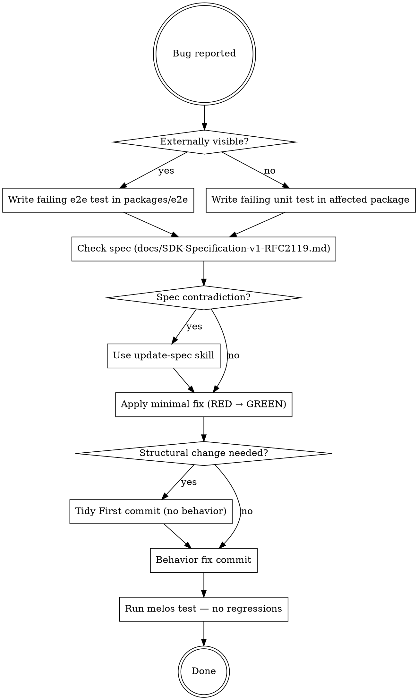

# Patch a Bug

## Overview

Bugs and patches are a special development flow. They arise from bad implementations **and/or spec oversights** — both must be checked. The fix MUST be anchored in a failing test before any code changes.

**Core principle:** Step 0 is always a failing test. Code comes after.

## The Flow



## Step 0: Failing Test First — Always

If the bug is **externally visible** (wrong treatment, bad readiness event, incorrect flush, broken auth — anything observable when using the SDK):

1. Go to `packages/e2e/`
2. Write a test using `MockWebServer` that **reproduces the bug exactly**
3. Run it — it MUST fail before you touch a single implementation file
4. Commit the failing test as its own commit (documents the bug)

If the bug is **internal only** (wrong internal state, wrong calculation, unreachable code path):

1. Write a failing unit test in the affected package's `test/` directory
2. Run it — it MUST fail

**The test is the bug report. If it passes before the fix, it's wrong.**

## Step 1: Check the Spec

Read `docs/SDK-Specification-v1-RFC2119.md` — specifically the section governing the buggy behavior.

Ask: **Does the spec describe what the code is doing, or what it should do?**

- If the code contradicts the spec → the code is wrong; fix it
- If the spec describes the broken behavior → the spec is wrong; use the `update-spec` skill before fixing
- If the spec is silent → the bug is an implementation gap; document your intent in the fix commit

**Never fix a bug that contradicts the spec without resolving the spec first.**

## Step 2: Plan the Fix Scope

Before writing any code, identify:
- Root cause (not symptoms)
- Which packages are affected
- Whether a structural change (rename, move, extract) is needed first

If structural changes are needed: **Tidy First**. Structural commit lands before behavioral fix — never mixed.

## Step 3: RED → GREEN → REFACTOR

- RED: test fails, implementation unchanged
- GREEN: minimal code to make the test pass — nothing extra
- REFACTOR: clean up with tests green; separate commit

## Step 4: Regression Check

```
melos test
melos analyze
dart format --set-exit-if-changed .
```

All must pass. A fix that breaks another package is not done.

## Red Flags — You Are Doing This Wrong

| Thought | Reality |
|---|---|
| "Let me read the code first, then write the test" | Step 0 is the test. Code reading comes after. |
| "The bug is obvious, no need for an e2e test" | Obvious bugs have non-obvious interactions. Write the test. |
| "The spec probably covers this, I'll skip reading it" | Bugs often ARE spec oversights. Read it. |
| "I'll fix the spec after" | Spec and fix land together. Never one without the other. |
| "This is too small to need Tidy First" | Mixed structural+behavioral commits make blame and revert impossible. Separate them. |

## Checklist

- [ ] Failing e2e test written (if externally visible) — runs red before any fix
- [ ] Spec section read and checked for contradiction
- [ ] If spec is wrong: `update-spec` skill invoked and spec updated
- [ ] Structural changes committed separately (Tidy First)
- [ ] Minimal behavioral fix committed — tests now green
- [ ] `melos test` passes with no regressions
- [ ] `melos analyze` clean
