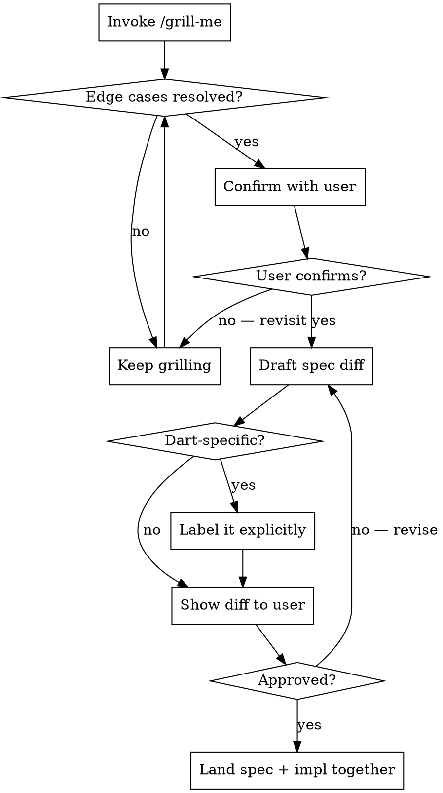

# Update Spec

## Overview

Changes to `docs/SDK-Specification-v1-RFC2119.md` are binding contracts. Edge cases explored after drafting produce spec debt. Dart-specific content that bleeds into normative text misleads non-Dart implementers.

**Process: Grill → Draft → Approve → Land together.**

## Required Process

### Step 1 — Grill First (MANDATORY)

**MUST invoke `/grill-me` before drafting any spec text.**

Do NOT draft, do NOT consider edge cases alone — use grill-me to explore, then **confirm the resolved edge cases with the user before moving to Step 2**. Even if grill-me produces a clear picture, the user must agree before any text is drafted.
- Corner cases and failure modes
- Interactions with other spec sections
- Ambiguities that cause divergent implementations
- Behaviours across all evaluation entry points (not just the one named)

Red flag: if you find yourself thinking "I'll handle edge cases in the draft" — stop. That is the violation. Invoke grill-me.

### Step 2 — Draft (After Grill)

**Language:**
- MUST use RFC 2119 keywords: `MUST`, `MUST NOT`, `SHALL`, `SHOULD`, `SHOULD NOT`, `MAY`, `OPTIONAL`
- MUST NOT weaken normative language without explicit user approval
- Interoperability / harm-prevention → `MUST`; internal convenience → `SHOULD` or `MAY`

**Scope:**
- Keep language agnostic by default
- If a clarification is Dart-specific: **label it `(Dart-specific)`** or place it in a clearly-marked Dart subsection — never embed it in the normative prose

**Structure:**
- Preserve existing section numbering, heading levels, table formats
- Do NOT modify the Requirements Language preamble

### Step 3 — Show and Get Approval

Show the diff. Flag any conflict with existing sections. Do not edit the file until the user approves.

### Step 4 — Land Together

The spec change and its corresponding implementation change MUST land in the same commit.

**Keep the module map in sync.** If the change touches the module decomposition — adding, removing, renaming, or re-homing any §3 module, port, or SPI — you MUST update `docs/SPEC-MODULE-MAP.md` (the spec-module → package/path traceability table) in the **same commit**. This table is what prevents drift between spec §3, `docs/PACKAGE-STRUCTURE-v1-design.md`, and `packages/` on disk. A §3 change that lands without a matching map update is incomplete.

## Quick Reference

| Use case | Keyword |
|----------|---------|
| Required for interoperability | `MUST` |
| Forbidden | `MUST NOT` |
| Recommended, deviation allowed | `SHOULD` |
| Implementation convenience | `MAY` |
| Dart-only behaviour | Label `(Dart-specific)` |

## Common Mistakes

| Mistake | Fix |
|---------|-----|
| Drafting before grill-me | Delete draft. Invoke grill-me first. |
| Treating grill-me output as approval | After grill-me, summarise findings and explicitly ask the user to confirm before drafting |
| Judging edge cases "resolved" yourself | grill-me surfaces them; the user confirms resolution — not you |
| Edge cases considered *after* drafting | Those edge cases belong in the grill session, not the diff review |
| Dart types/idioms in normative prose | Move to a labelled Dart subsection |
| Changing `MUST` to `SHOULD` silently | Requires explicit user approval |
| Spec and impl landing in separate commits | They MUST land together |
| Changing a §3 module without updating the map | Update `docs/SPEC-MODULE-MAP.md` in the same commit |
