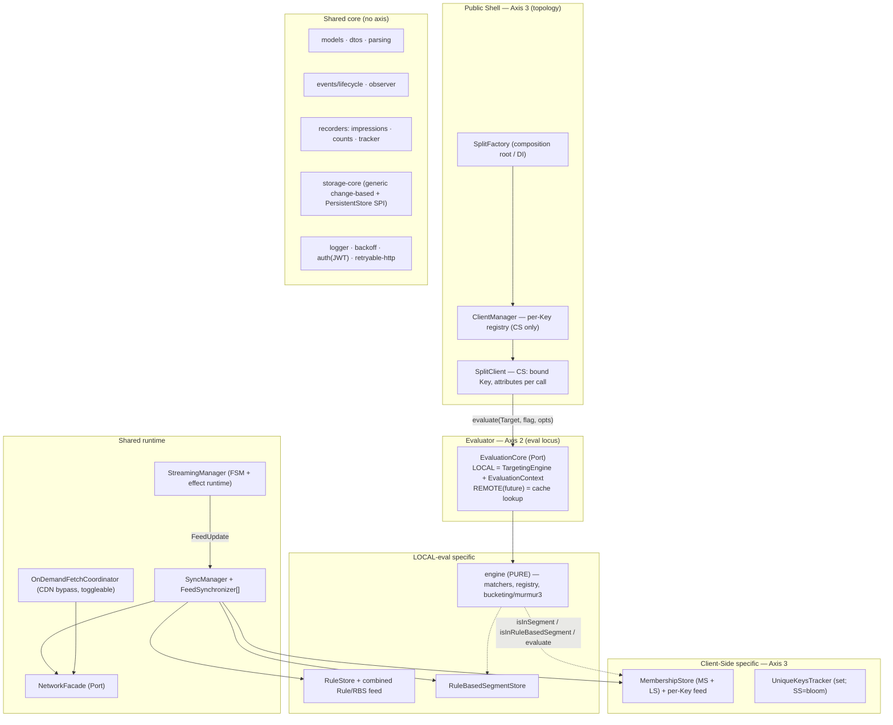
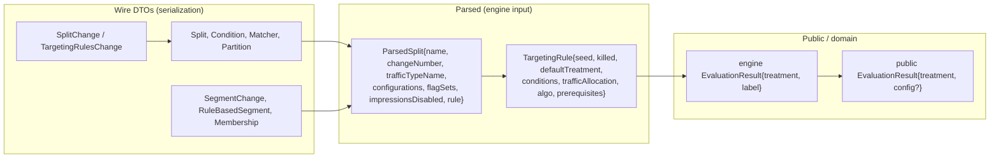
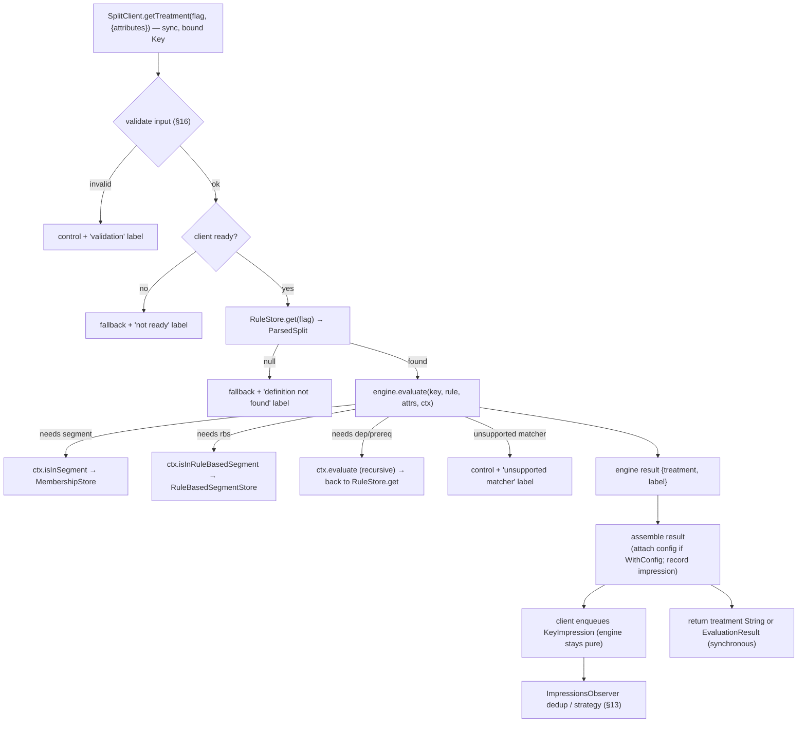
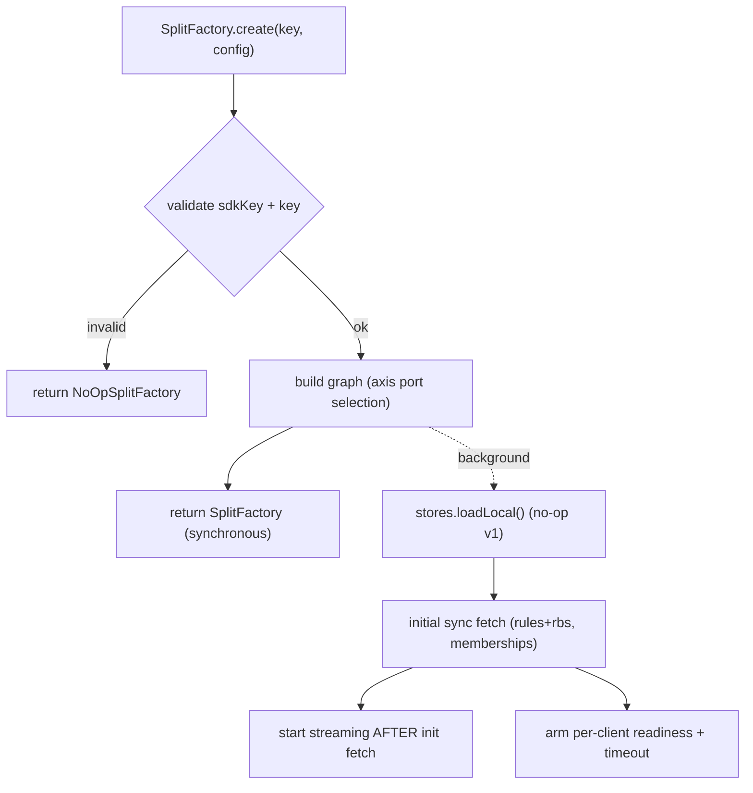
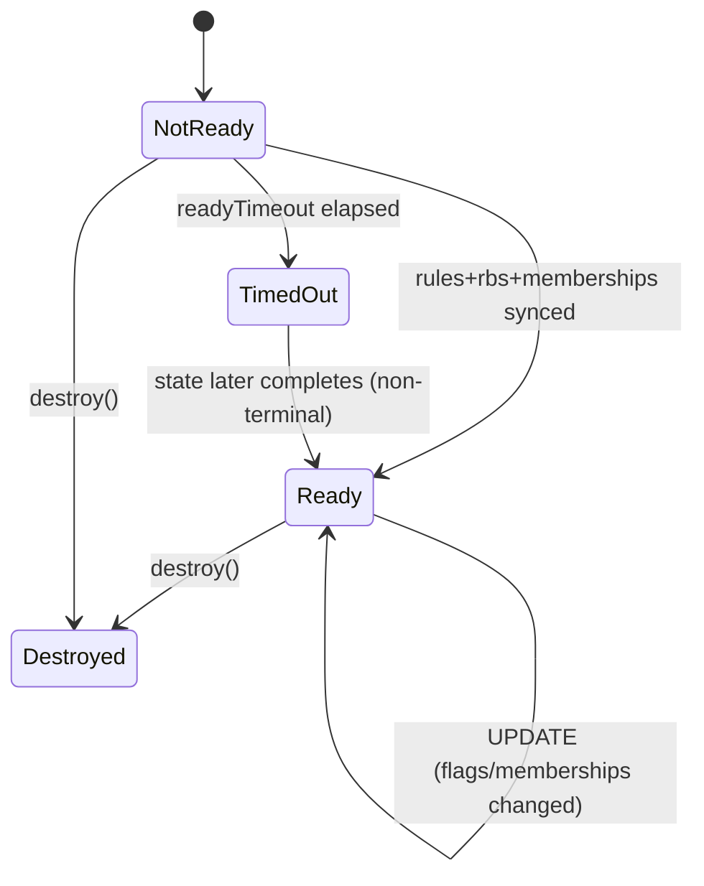
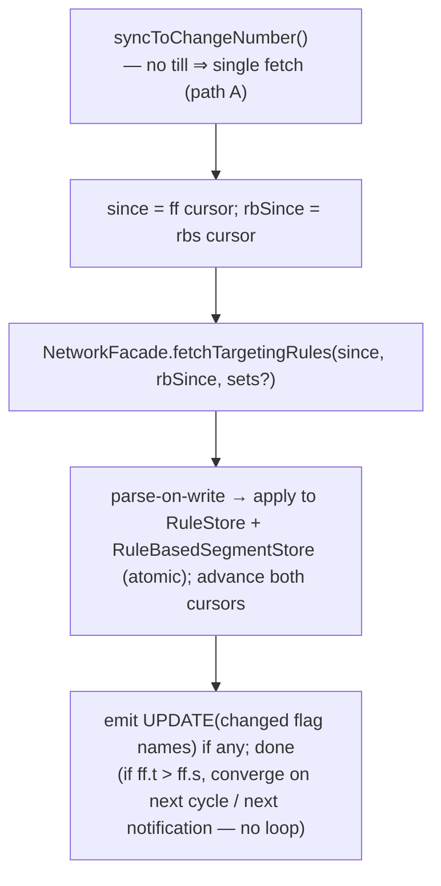
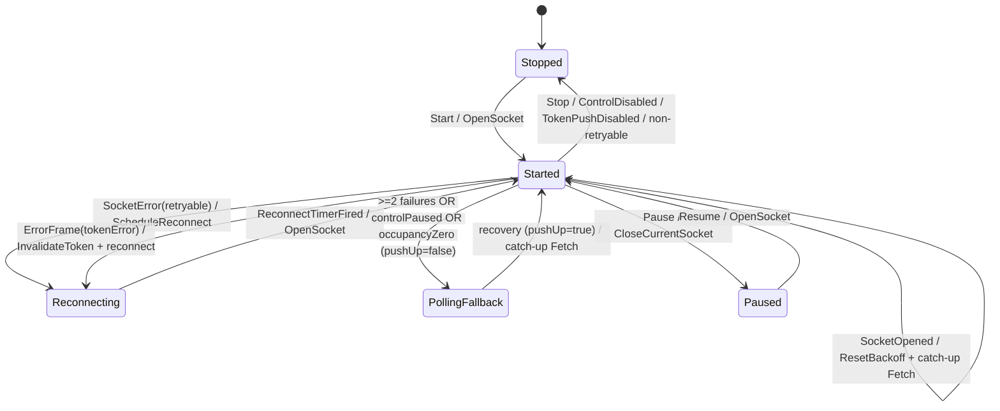

# Split/FME Dart SDK — Architecture Specification (v1.1, RFC 2119 Normative Edition)

> **Status:** Draft v1.1 — implementation-oriented architecture specification, normative edition.
> **Purpose:** Define the architecture, module decomposition, ports/SPIs, data model, and
> runtime contracts for a unified Split feature-flag SDK, derived from `go-client`
> (+ `go-split-commons`), `android-client` (full local SDK), `android-thin-client` (remote SDK),
> and `jvm-commons` (extracted shared core: `targeting-engine`, `parsing-commons`,
> `segment-commons`, `impressions`, `tracker`, `observer`, `events`).
> **Target:** pure Dart, platform-agnostic. The concurrency model (§9) is the one place where a
> Dart commitment is intentionally baked in. A separate Dart-specific document covers packaging,
> serialization, and concrete platform implementations.

## Requirements Language

The key words "MUST", "MUST NOT", "REQUIRED", "SHALL", "SHALL NOT", "SHOULD", "SHOULD NOT",
"RECOMMENDED", "MAY", and "OPTIONAL" in this document are to be interpreted as described in
[RFC 2119](https://www.rfc-editor.org/rfc/rfc2119).

These imperatives are used with care and sparingly, and only where actually required for
interoperation with the reference SDKs / Harness FME backend, or to limit behavior that has
potential for causing harm (e.g., torn reads, CDN cache fragmentation, precision loss). Where a
behavior is an internal implementation convenience rather than an interoperability requirement, it
is expressed as SHOULD or MAY.

---

## 1. Overview & Goals

The SDK MUST expose the Split feature-flag API (`getTreatment`, `track`, lifecycle events) and MUST
serve treatments by **evaluating rules locally** (v1). It MAY, in a future version, serve treatments
by **fetching pre-computed evaluations remotely**. The SDK MUST be packageable for both
**client-side** (one target per client) and **server-side** (one client, target per call)
topologies.

### 1.1 Design goals

1. **One shared core, multiple wirings.** The public API and most of the runtime MUST be identical
   across evaluation locus and topology. Variation MUST be confined to a small, explicit set of
   seams.
2. **Pure, dependency-free evaluation engine.** The rule-match engine MUST perform no I/O and MUST
   hold no SDK state (mirrors `targeting-engine`). It MUST be *rule-in, result-out*.
3. **Smallest useful v1** — **LOCAL × Client-Side** — while every future capability (REMOTE, SS,
   durable persistence, telemetry) MUST exist as a **declared port/SPI with a v1 default**.
4. **Pure Dart, single isolate.** Synchronous evaluation MUST be atomic by construction (§9); the
   design MUST NOT require locks.

### 1.2 v1 scope (one sentence)

> **v1 = LOCAL evaluator × Client-Side topology, polling + streaming sync (full FSM), events +
> impressions recorders (3 modes), in-memory storage with a no-op persistence seam.**

---

## 2. The Three-Axis Architecture

Every point of variation MUST lie on exactly **one of three orthogonal axes**. This is the
discriminator for the entire module decomposition:

> **A feature MUST earn a port or SPI *only if* it varies along one of these three axes. Everything
> else MUST be shared and concrete.**

| Axis | Question | Mechanism | Chosen by | v1 value |
|------|----------|-----------|-----------|----------|
| **1. Platform** | *How do we reach the OS/runtime?* | **SPI** | host / runtime | simplest / no-op |
| **2. Eval Locus** | *Where does evaluation happen?* (local vs remote) | **Port** | `SplitFactory` | LOCAL |
| **3. Topology** | *Whose key is it?* (client- vs server-side) | **Port** | `SplitFactory` | Client-Side |

- **Axis 1 — Platform → SPIs:** `HttpClient` (buffered request/response) and `StreamingTransport` (long-lived SSE byte stream) — **the same "network I/O on this runtime" layer**, just buffered vs. streaming flavors; `PersistentStore` (durable engine, no-op v1), `Decompressor` (gzip/zlib), `Clock`/`Scheduler`.
- **Axis 2 — Eval Locus → Ports:** `Evaluator` (LOCAL engine+context | REMOTE cache lookup), `NotificationProcessor` (data-notification parsing), `NetworkFacade` (endpoint set).
- **Axis 3 — Topology → Ports:** public shell (bound vs per-call target), segment resolution (`isInSegment`: membership vs global segment), client multiplicity (`ClientManager` vs single), `UniqueKeysTracker` (CS set vs SS bloom).

### 2.1 Architecture overview



### 2.2 Dependency invariants

1. **`engine` MUST depend on nothing** — no dtos, storage, or I/O; it MUST reach the host only via `EvaluationContext`.
2. **Dependencies MUST point inward**: shell → ports → engine/storage. No module MUST import the shell.
3. **Variation MUST be confined** to: public shell, `Evaluator` wiring, `EvaluationContext.isInSegment` backing, `NotificationProcessor`, `NetworkFacade`, `UniqueKeysTracker`.
4. **`getTreatment` MUST be synchronous, pure, and non-throwing.** All I/O MUST be background, behind ports.
5. **Every reserved seam MUST have a v1 default** (no-op or LOCAL/CS impl) — it MUST NOT be a TODO requiring core surgery.

---

## 3. Module Catalog

### 3.1 Shared core (no axis)

| Module | Responsibility | Key contracts |
|--------|----------------|---------------|
| `models` | Public domain objects | `Key`, `Target`, `Attributes`, public `EvaluationResult`, `EvaluationOptions`, `ParsedSplit` metadata |
| `dtos` | Wire/serialization types | `Split`, `SplitChange`/`TargetingRulesChange`, `SegmentChange`, `RuleBasedSegment`, `Condition`, `Matcher`, `MatcherGroup`, `Partition`, `KeySelector` |
| `parsing` | DTO → parsed engine model | `RuleParser`/`SplitChangeProcessor` → `ParsedSplit` (+ inner `TargetingRule`) |
| `engine` | **Pure** rule-match (no I/O) | `TargetingEngine`, engine `EvaluationResult`, `EvaluationContext`, `Matcher`, `MatcherRegistry`, `Bucketer` (murmur3) |
| `events` | Readiness/lifecycle manager, topologically ordered, milestone-latched | `EventsManager`, `SplitInternalEvent` |
| `observer` | Generic pub/sub primitive (see §20) | `CompositeObserver`, `Observer`, `ObserverRegistry`, `ObservableEvent` |
| `logger` | Logging abstraction | `Logger`, `LogLevel` |
| `backoff` | Retry backoff math | `ExponentialBackoffCounter`, `FixedIntervalBackoffCounter` |
| `auth` | Per-endpoint credential provisioning (Strategy); JWT cache/fetch for streaming | `AuthProvider` (port), `StaticKeyAuthProvider` (sdkKey), `JwtAuthProvider` (cached/deduped/on-demand), `Credential`/`JwtCredential{token, channels, pushEnabled, expiresAt, connDelaySeconds}` |
| `retryable-http` | Retry/backoff + status taxonomy **over the `HttpClient` SPI** (Axis 1) | `RetryableHttpClient`, `HttpStatus`, `HttpClient` (SPI) |
| `storage-core` | Generic change-based store + in-memory + persistence seam | `Store<T>`, per-entity ports, `PersistentStore` (SPI) |
| `recorders` | Queue → batch → flush | `Recorder<T>`, `ImpressionsRecorder`, `ImpressionsCountRecorder`, `UniqueKeysRecorder`, `EventsRecorder` |
| `sync` | Inbound freshness coordinator | `SyncManager`, `FeedSynchronizer`, `OnDemandFetchCoordinator`, `StreamingManager`, `StreamingPolicy` |

### 3.2 LOCAL-eval specific (Axis 2 = LOCAL)

| Module | Responsibility | Key contracts |
|--------|----------------|---------------|
| `local-evaluator` | Wire engine + `EvaluationContext` over stores; lookup + metadata assembly | implements `Evaluator` |
| `rules` | `ParsedSplit` store + combined rule/rbs feed + flagSet index | `RuleStore`, `RuleBasedSegmentStore`, `RuleFeed` |
| `local-network` | Typed `NetworkFacade` for LOCAL | `fetchTargetingRules(since, rbSince, sets?, till?)`, `fetchMemberships(key)`, recorder POSTs. **MUST emit query params in the canonical §10.4 order** (`s`→`since`→`rbSince`→[`sets`]→[`till`]) for CDN cache stability |
| `local-notifications` | `NotificationProcessor` (data notifications) | `SPLIT_UPDATE`/`SPLIT_KILL`/`MEMBERSHIPS_MS_UPDATE`/`MEMBERSHIPS_LS_UPDATE`/`RB_SEGMENT_UPDATE` → `FeedUpdate` |

### 3.3 Client-Side specific (Axis 3 = CS)

| Module | Responsibility | Key contracts |
|--------|----------------|---------------|
| `cs-client` | Public shell with bound `Key` | `SplitClient.getTreatment(flag, {attributes, opts})` |
| `client-manager` | Per-`Key` registry; ref-counts shared sync; mutates streaming channel set | `ClientManager.getOrCreate/destroy/destroyAll` |
| `memberships` | Per-`Key` standard (MS) + large (LS) segment store + feed; payload decoder | `MembershipStore`, `MembershipFeed`, `MembershipPayloadDecoder` |
| `cs-unique-keys` | In-memory set-based MTK tracker | implements `UniqueKeysTracker` |

### 3.4 Reserved seams (declared, not implemented in v1)

These seams MUST be declared as ports/SPIs and MUST NOT be implemented in v1 beyond the stated v1
default.

| Seam | Axis | v1 default |
|------|------|-----------|
| `RemoteEvaluator` + eval-fetch/cache + secure-http | 2 (REMOTE) | absent; `Evaluator` port reserved |
| remote `NotificationProcessor` (`EVALUATION_UPDATE`) | 2 (REMOTE) | absent; port reserved |
| SS public shell (target per call) | 3 (SS) | absent; CS shell only |
| Global `SegmentStore` + segment feed | 3 (SS) | absent; CS `MembershipStore` only |
| SS `UniqueKeysTracker` (bloom + MTK) | 3 (SS) | CS set impl only |
| `PersistentStore` impl | 1 | **no-op** impl present (`loadLocal()` always called) |
| `telemetry` recorder | shared | absent; `Recorder<T>` shape reused later |
| Large-segment matcher in SS | 3 | CS-supported; **SS = unsupported matcher → control** |

---

## 4. Data Model

The model MUST have **three layers** (wire → parsed → public) and MUST use **two
`EvaluationResult` types** and a **two-object rule model**.



### 4.1 Core domain types

```
Key            { matchingKey: String, bucketingKey: String? }   // bucketingKey defaults to null (NOT matchingKey)
Target         { key: Key, attributes: Attributes, trafficType: String? }
Attributes     = Map<String, AttrValue>
AttrValue      = String | num | bool | List<String> | DateTime(epoch millis)
                 // missing/null attribute → matcher returns false
EvaluationOptions { properties: Map<String, Object?>? }          // attached to impression, NOT used by engine
```

- `Key.bucketingKey` MUST default to `null` when absent — it MUST NOT default to `matchingKey`. The
  fallback to `matchingKey` MUST happen only at bucketing-computation time, where the engine resolves
  `bk = bucketingKey ?? matchingKey` (§5.2). A `null` `bucketingKey` MUST therefore be preserved as
  `null` everywhere it is passed (e.g. to condition matchers and nested evaluation), and MUST be
  resolved to `matchingKey` only for the traffic-allocation gate and treatment bucketing.
- A missing or `null` attribute referenced by a matcher MUST cause that matcher to return `false`.
- `EvaluationOptions.properties` MUST be attached to the impression and MUST NOT be consumed by the
  engine.

### 4.2 Two `EvaluationResult` types

```
engine.EvaluationResult { treatment: String, label: String }            // pure, always has label
public.EvaluationResult { treatment: String, config: String? }          // returned by WithConfig methods only
```

- The engine result `label` MUST always be present (used internally for impressions).
- The public `EvaluationResult` MUST contain only `treatment` and `config`. Internal metadata
  (`label`, `changeNumber`, `flag`) MUST NOT be exposed to SDK consumers.
- The base `getTreatment*` methods MUST return only the treatment `String` (or `'control'` on error).
  The `WithConfig` variants MUST return `EvaluationResult` containing both treatment and config.

### 4.3 Rule model (stored vs engine)

- **`ParsedSplit`** (stored in `RuleStore`): `{ name, changeNumber, trafficTypeName, configurations(Map<treatment,config>), flagSets, impressionsDisabled, rule: TargetingRule }`.
- **`TargetingRule`** (engine input only): `{ seed, killed, defaultTreatment, conditions, trafficAllocation, trafficAllocationSeed, algo, prerequisites }`.
- The engine MUST **only ever receive `TargetingRule`**; metadata (config/changeNumber) MUST be
  attached by the `local-evaluator`, not by the engine.

### 4.4 Segment / membership model

- **Standard memberships (MS)** and **large-segment memberships (LS)** MUST be stored per `Key` in CS.
- `RuleBasedSegment` (global) MUST be parsed and stored in `RuleBasedSegmentStore`.
- Matcher backing: `UserDefinedSegmentMatcher` → MS via `isInSegment`; large-segment matcher → LS (CS); `RuleBasedSegmentMatcher` → `RuleBasedSegmentStore`. In SS, the large-segment matcher MUST be treated as unsupported → control.

### 4.5 Recorder payload types

```
KeyImpression { feature, keyName, bucketingKey?, treatment, label, changeNumber, time, pt?, properties? }
Event         { eventTypeId, trafficTypeName, key, value?, properties?, timestamp }
ImpressionsCount (per feature, per hourly time-bucket)
UniqueKeys (MTK) (feature → set of keys)
```

### 4.6 Lifecycle event

```
Readiness events:
- READY — latched; delivered as Future<void> whenReady()
- READY_TIMEOUT — latched; delivered as Future<void> whenTimeout()
- UPDATE — recurring; delivered as Stream<List<String>> whenUpdated() with payload of changed flag names (active + archived)
// READY_FROM_CACHE deferred to persistence SPI (§14)
```

- v1 MUST emit only `READY`, `READY_TIMEOUT`, and `UPDATE`. `READY_FROM_CACHE` MUST be deferred.
- The `UPDATE` payload MUST carry the changed flag names (active + archived).

---

## 5. Evaluation Boundary & Flow

**The engine MUST be rule-in/result-out and stateless. The `local-evaluator` MUST own all storage
lookups (including recursive `EvaluationContext` callbacks) and all metadata assembly.**

```
// engine
engine.EvaluationResult evaluate(matchingKey, bucketingKey, TargetingRule rule, Attributes, EvaluationContext)

// EvaluationContext (host callback — the recursion + segment seam)
engine.EvaluationResult evaluate(matchingKey, bucketingKey, ruleName, Attributes)   // Dependency / Prerequisites
bool isInSegment(segmentName, key)                                                  // UserDefinedSegment (CS: MembershipStore)
bool isInRuleBasedSegment(segmentName, key, bucketingKey, Attributes)               // RuleBasedSegment
// (large-segment membership resolved analogously via a CS-backed matcher; SS unsupported)
```



- Rules MUST be **parsed once at sync time** (parse-on-write); evaluation MUST NOT parse.
- The client MUST wrap evaluation in a guard: **any internal error → control + `exception` label**;
  it MUST NOT throw (§15).

### 5.1 `EvaluationContext` (the host callback seam)

`EvaluationContext` MUST be the **only** way the pure engine reaches outside itself. The engine and
every matcher MUST be *rule-in / result-out*; whenever a matcher needs to (a) recurse into another
flag, (b) test standard-segment membership, or (c) test rule-based-segment membership, it MUST call
back through this interface. The host (the `local-evaluator` in v1) MUST implement it over the
stores.

```dart
// EvaluationContext — implemented by the host (local-evaluator), consumed by the engine + matchers.
abstract class EvaluationContext {
  // (a) Recursive flag evaluation — used by DependencyMatcher and PrerequisitesMatcher.
  //     Re-enters RuleStore.get(ruleName) → engine.evaluate(...), so the same context threads
  //     through nested evaluations. Returns the engine EvaluationResult {treatment, label}.
  engine.EvaluationResult evaluate(
      String matchingKey, String bucketingKey, String ruleName, Attributes attributes);

  // (b) Standard-segment membership — used by UserDefinedSegmentMatcher.
  //     CS: backed by MembershipStore (per-Key MS). SS (future): global SegmentStore.
  bool isInSegment(String segmentName, String key);

  // (c) Rule-based-segment membership — used by RuleBasedSegmentMatcher.
  //     Takes BOTH key and bucketingKey + attributes, because an rbs can itself contain
  //     bucketing/attribute-based conditions that must be re-evaluated against the same target.
  //     Backed by RuleBasedSegmentStore.
  bool isInRuleBasedSegment(
      String segmentName, String key, String bucketingKey, Attributes attributes);
}
```

**Contract notes (mirroring the Java engine):**

- **Matchers MUST receive the context** — `Matcher.match(matchingKey, bucketingKey, attributes, context)`.
  The engine itself MUST call `context.evaluate(...)` only indirectly, via the `Prerequisites`/`Dependency`
  matchers; segment matchers MUST call `isInSegment` / `isInRuleBasedSegment` directly.
- **`evaluate` MUST return the engine result** (`{treatment, label}`, §4.2) — *not* the public result.
  Dependency/Prerequisites logic MUST compare the returned `treatment` against an expected set; no
  config or changeNumber is needed at this layer.
- **`isInRuleBasedSegment` is the asymmetric one:** it MUST carry `key` + `bucketingKey` +
  `attributes` (a near-full target), whereas `isInSegment` MUST carry only a flat `key`. A standard
  segment is a pure membership set; a rule-based segment MAY re-evaluate conditions, so it needs the
  bucketing key and attributes.
- **Pure-engine boundary:** the context MUST perform all I/O-free *lookups* the engine needs; it MUST
  NOT parse, MUST NOT mutate SDK state, and (by §9) MUST run synchronously within the same event-loop
  turn as `getTreatment`, so recursion is atomic and lock-free.
- **Failure mode:** a lookup the host cannot satisfy (unknown segment, missing rbs) MUST resolve to
  `false`/non-match rather than throwing; engine-level exceptions MUST be wrapped
  (`VersionedExceptionWrapper` in Java) and MUST surface to the client guard as control + `exception`
  (§15).

> The three methods above are the entire surface. Everything topology- or locus-specific
> (`MembershipStore` vs global `SegmentStore`, LOCAL store lookups vs REMOTE cache) MUST hide behind
> this interface, which is why the engine can stay byte-for-byte identical across all four
> locus × topology wirings.

### 5.2 Engine evaluation algorithm (`TargetingEngine.evaluate`)

The pure engine MUST implement the following deterministic, ordered algorithm. It mirrors
`targeting-engine` `TargetingEngineImpl.evaluate(matchingKey, bucketingKey, rule, attributes, context)`
and MUST return an engine `EvaluationResult {treatment, label}`. Any exception thrown internally MUST
be wrapped (`VersionedExceptionWrapper` in Java) and MUST surface to the client guard as control +
`exception` (§15).

1. **Killed check.** If `rule.killed` → the engine MUST return `(rule.defaultTreatment, "killed")`.
2. **Bucketing-key resolution.** The engine MUST compute `bk = bucketingKey ?? matchingKey`.
3. **Prerequisites.** The engine MUST evaluate `rule.prerequisites` (via `PrerequisitesMatcher`, see
   §5.4): for each prerequisite,
   `ctx.evaluate(matchingKey, bk, prereq.featureFlagName, attributes).treatment` MUST be contained in
   `prereq.treatments`. If any fails → the engine MUST return
   `(rule.defaultTreatment, "prerequisites not met")`.
4. **Condition loop** (in order over `rule.conditions`):
   - **Traffic allocation gate** — MUST be applied **once**, immediately before the **first
     `ROLLOUT` condition** is considered (and MUST NOT be applied for `WHITELIST` conditions). If
     `rule.trafficAllocation < 100`:
     `bucket = Bucketer.getBucket(bk, rule.trafficAllocationSeed, rule.algo)`; if
     `bucket > rule.trafficAllocation` → the engine MUST return
     `(rule.defaultTreatment, "not in split")`. After the gate runs once it MUST NOT be re-applied
     for subsequent conditions.
   - **Condition match** — if `condition.matcher.match(matchingKey, bucketingKey, attributes, ctx)`
     is true → `treatment = Bucketer.getTreatment(bk, rule.seed, condition.partitions, rule.algo)`;
     the engine MUST return `(treatment, condition.label)`.

     > Note the asymmetry, which MUST be preserved verbatim from Java: the **traffic-allocation** gate
     > and the **treatment bucketing** MUST hash the resolved `bk`, but the **condition matcher** MUST
     > be invoked with the *raw* `bucketingKey` (which MAY be `null`). Matchers that need a bucketing
     > key are segment / dependency matchers that operate on the matching key; the distinction only
     > matters for a `null` bucketing key passed down to nested evaluation.
5. **Default rule.** If no condition matched → the engine MUST return
   `(rule.defaultTreatment, "default rule")`.

```
engine.EvaluationResult evaluate(matchingKey, bucketingKey, TargetingRule rule, attributes, ctx):
  if rule.killed: return (rule.defaultTreatment, KILLED)
  bk = bucketingKey ?? matchingKey
  if not prerequisitesMatch(rule.prerequisites, matchingKey, bk, attributes, ctx):
      return (rule.defaultTreatment, PREREQUISITES_NOT_MET)
  inRollout = false
  for condition in rule.conditions:
      if not inRollout and condition.type == ROLLOUT:
          if rule.trafficAllocation < 100:
              if getBucket(bk, rule.trafficAllocationSeed, rule.algo) > rule.trafficAllocation:
                  return (rule.defaultTreatment, NOT_IN_SPLIT)
          inRollout = true
      if condition.matcher.match(matchingKey, bucketingKey, attributes, ctx):
          return (getTreatment(bk, rule.seed, condition.partitions, rule.algo), condition.label)
  return (rule.defaultTreatment, DEFAULT_RULE)
```

**`ConditionType`** ∈ `{ WHITELIST, ROLLOUT }`. `Condition = { conditionType, matcher: CombiningMatcher,
partitions: List<Partition>, label }`. `Partition = { treatment: String, size: int }` (size is a
percentage 0–100).

### 5.3 Bucketing & treatment selection (`Bucketer`)

Deterministic hashing MUST map a key into a **bucket in `[1, 100]`** and MUST select a treatment from
the ordered partition list. Source: `targeting-engine` `Bucketer` + `MurmurHash3`.

- **Algorithms (`rule.algo`):** `2 = MURMUR3` (`murmurhash3_x86_32(key, seed)`, RECOMMENDED/default
  for new flags), `1 = LEGACY` (and any other value MUST fall through to legacy).
  - **Legacy hash:** `h = 0; for ch in key: h = 31*h + ch; return (h XOR seed)` — MUST use 32-bit
    signed arithmetic (overflow wraps).
  - **Murmur hash:** `MurmurHash3.murmurhash3_x86_32(utf8(key), seed)` MUST return the 32-bit value
    as an unsigned long (`& 0xFFFFFFFF`).
- **Bucket:** `bucket = abs(hash mod 100) + 1` → integer in `[1, 100]`.
- **Treatment selection** (`getTreatment(key, seed, partitions, algo)`):
  1. If `partitions` is empty → MUST return `"control"`.
  2. **100%-single-partition shortcut:** if there is exactly one partition with `size == 100` →
     MUST return that partition's treatment **without hashing**.
  3. Otherwise it MUST compute the bucket, then walk partitions accumulating `covered += size`; it
     MUST return the first partition where `covered >= bucket`. If none covers the bucket → MUST
     return `"control"`.
- **`getBucket(key, seed, algo)`** (used by the traffic-allocation gate) MUST return the bucket only.

> **Murmur is the x86_32 variant** for bucketing — distinct from the x64_128 variant used for
> membership key hashing (§12.3). The Dart port MUST implement both and MUST keep them byte-compatible
> with `MurmurHash3` (UTF-8 encoding handled inline, surrogate-pair aware).

### 5.4 Matcher catalog (wire type → engine matcher → semantics)

A `Condition.matcher` MUST be a **`CombiningMatcher`**: a list of `AttributeMatcher`s combined with
`Combiner.AND` (the only combiner; **all** delegates MUST match). An empty delegate list MUST yield
no match.

Each **`AttributeMatcher`** MUST wrap one delegate `Matcher` plus an optional **attribute selector**
and a **negate** flag (via an inner `NegatableMatcher`):

- **Value resolution.** If the matcher has **no attribute** (`keySelector.attribute == null`), the
  delegate MUST receive the **matching key** (a `String`) and the full `attributes` map + context. If
  an attribute **is** selected, the delegate MUST receive `attributes[attribute]`; a **`null`/missing
  attribute → the matcher MUST return `false`** (and the delegate MUST be invoked with
  `attributes = null`, `context = null` — i.e. attribute-scoped matchers MUST NOT recurse or hit
  segments).
- **Negation.** `negate` MUST invert the delegate's boolean result *after* evaluation.

The wire `Matcher` DTO carries `{ keySelector{trafficType, attribute}, matcherType, negate, ...one
typed data field... }`. Mapping (source: `parsing-commons` `ParserUtils.toMatcher` +
`MatcherType`):

| Wire `matcherType` | Engine matcher | Data field (DTO) | Input | Semantics |
|--------------------|----------------|------------------|-------|-----------|
| `ALL_KEYS` | `AllKeysMatcher` | — | any | `true` for any non-null value |
| `IN_SEGMENT` | `UserDefinedSegmentMatcher` | `userDefinedSegmentMatcherData.segmentName` | String | `ctx.isInSegment(name, value)` |
| `IN_RULE_BASED_SEGMENT` | `RuleBasedSegmentMatcher` | `userDefinedSegmentMatcherData.segmentName` | String | `ctx.isInRuleBasedSegment(name, value, bucketingKey, attributes)` |
| `WHITELIST` | `WhitelistMatcher` | `whitelistMatcherData.whitelist` | String | value ∈ whitelist set (exact) |
| `EQUAL_TO` | `EqualToMatcher` | `unaryNumericMatcherData{value, dataType}` | NUMBER/DATETIME | numeric/date equality (§5.5) |
| `GREATER_THAN_OR_EQUAL_TO` | `GreaterThanOrEqualToMatcher` | `unaryNumericMatcherData{value, dataType}` | NUMBER/DATETIME | `value >= compareTo` |
| `LESS_THAN_OR_EQUAL_TO` | `LessThanOrEqualToMatcher` | `unaryNumericMatcherData{value, dataType}` | NUMBER/DATETIME | `value <= compareTo` |
| `BETWEEN` | `BetweenMatcher` | `betweenMatcherData{start, end, dataType}` | NUMBER/DATETIME | `start <= value <= end` |
| `EQUAL_TO_SET` | `EqualToSetMatcher` | `whitelistMatcherData.whitelist` | List<String> | value-set **==** compareTo-set |
| `CONTAINS_ANY_OF_SET` | `ContainsAnyOfSetMatcher` | `whitelistMatcherData.whitelist` | List<String> | value-set ∩ compareTo ≠ ∅ |
| `CONTAINS_ALL_OF_SET` | `ContainsAllOfSetMatcher` | `whitelistMatcherData.whitelist` | List<String> | value-set ⊇ compareTo (empty compareTo → false) |
| `PART_OF_SET` | `PartOfSetMatcher` | `whitelistMatcherData.whitelist` | List<String> | value-set ⊆ compareTo (empty value → false) |
| `STARTS_WITH` | `StartsWithAnyOfMatcher` | `whitelistMatcherData.whitelist` | String | value startsWith any entry (empty entries skipped) |
| `ENDS_WITH` | `EndsWithAnyOfMatcher` | `whitelistMatcherData.whitelist` | String | value endsWith any entry |
| `CONTAINS_STRING` | `ContainsAnyOfMatcher` | `whitelistMatcherData.whitelist` | String | value contains any entry |
| `MATCHES_STRING` | `RegularExpressionMatcher` | `stringMatcherData` | String | regex `pattern.find()` (partial match) |
| `EQUAL_TO_BOOLEAN` | `BooleanMatcher` | `booleanMatcherData` | bool/String | coerced bool **==** compareTo (§5.5) |
| `IN_SPLIT_TREATMENT` | `DependencyMatcher` | `dependencyMatcherData{split, treatments}` | String | `ctx.evaluate(value, bk, split, attrs).treatment` ∈ treatments |
| `EQUAL_TO_SEMVER` | `EqualToSemverMatcher` | `stringMatcherData` | String | semver equality (§5.6) |
| `GREATER_THAN_OR_EQUAL_TO_SEMVER` | `GreaterThanOrEqualToSemverMatcher` | `stringMatcherData` | String | `compare(value, target) >= 0` |
| `LESS_THAN_OR_EQUAL_TO_SEMVER` | `LessThanOrEqualToSemverMatcher` | `stringMatcherData` | String | `compare(value, target) <= 0` |
| `BETWEEN_SEMVER` | `BetweenSemverMatcher` | `betweenStringMatcherData{start, end}` | String | `start <= value <= end` (semver compare) |
| `IN_LIST_SEMVER` | `InListSemverMatcher` | `whitelistMatcherData.whitelist` | String | normalized semver ∈ list |

**Unrecognized `matcherType`** (or a `null` matcherType on the wire) MUST cause the **whole flag to
be replaced at parse time with an unsupported-matcher template condition** (a single
`ROLLOUT`/`AllKeys` condition assigning `control` with label
`targeting rule type unsupported by sdk`). Source: `ParserUtils.getTemplateCondition` /
`checkUnsupportedMatcherExist`. This is how the SDK MUST degrade gracefully (e.g. **large-segment
matcher in SS → control**, §15).

**Prerequisites** MUST NOT be a `matcherType` — they MUST live on the flag/rule
(`rule.prerequisites: List<Prerequisite{featureFlagName, treatments}>`) and MUST be evaluated by the
engine's built-in `PrerequisitesMatcher` **before** the condition loop (§5.2). The
`PrerequisitesMatcher` MUST require the `matchValue` to be a non-null `String` (else → no match), and
an empty/null prerequisite list MUST match (pass-through).

The `DependencyMatcher` likewise MUST require `matchValue` to be a non-null `String`; it MUST recurse
via `ctx.evaluate` and MUST test the returned **treatment** (not config) against its `treatments`
list.

### 5.5 Attribute coercion (`Transformers`)

Matchers MUST coerce the supplied attribute value before comparing. All coercion MUST be **null-safe —
an un-coercible value MUST yield `null`, which MUST make the matcher return `false`** (it MUST NOT
throw). Source: `targeting-engine` `Transformers`.

- **`asLong(obj)`** — MUST accept `Integer`/`Long` only → `long`; anything else (incl. `String`,
  `Double`) MUST yield `null`. (Numeric matchers therefore MUST only match integral attribute
  values.)
- **`asBoolean(obj)`** — MUST accept a `Boolean`, or a `String` equal (case-insensitive) to `"true"`/
  `"false"`; otherwise MUST yield `null`.
- **Date normalization (DATETIME `dataType`):**
  - `asDate(obj)` — MUST coerce to epoch-millis via `asLong`, then **zero out**
    hour/minute/second/millis in **UTC** (truncate to the day). MUST be used by `EqualToMatcher` (both
    the configured `compareTo` and the runtime value MUST be day-truncated).
  - `asDateHourMinute(obj)` — MUST coerce via `asLong`, then zero out **seconds + millis** in UTC
    (truncate to the minute). MUST be used by `BetweenMatcher`, `GreaterThanOrEqualToMatcher`,
    `LessThanOrEqualToMatcher` for DATETIME.
  - For `EqualToMatcher` the `compareTo` MUST be normalized with `asDate` at construction; the
    comparison matchers MUST normalize `compareTo` with `asDateHourMinute` at construction.
- **`toSetOfStrings(collection)`** — MUST map each element via `toString()` into a `Set<String>`; MUST
  be used by all collection (`*_SET`) matchers. The runtime value MUST be a `Collection`, else → false.

> **Dart mapping.** `AttrValue = String | num | bool | List<String> | DateTime(epoch millis)` (§4.1).
> Numeric coercion MUST match Java's integer-only `asLong` (so a `double`/fractional `num` MUST NOT
> coerce); DateTime attributes arrive as epoch-millis and MUST be truncated in **UTC** exactly as
> above.

### 5.6 Semver semantics (`Semver`)

Semver matchers MUST parse both the configured value and the runtime value with `Semver.build(...)`,
which MUST return `null` on any parse failure → matcher MUST return `false`. Source:
`targeting-engine` `Semver`.

- **Format:** `MAJOR.MINOR.PATCH` (exactly three numeric components, REQUIRED), optional
  `-prerelease` (dot-separated identifiers) and optional `+metadata`. An empty prerelease/metadata
  after the delimiter MUST be a parse error (`null`).
- **Normalization (`version()`):** numeric prerelease identifiers MUST be reparsed to canonical
  numeric form (drops leading zeros); metadata MUST be preserved in the canonical string.
  `EQUAL_TO_SEMVER` and `IN_LIST_SEMVER` MUST compare on this **normalized `version()` string** (so
  metadata participates in equality).
- **Precedence (`compare`)** — used by `>=`, `<=`, `between` — MUST be computed as:
  1. If normalized version strings are equal → `0`.
  2. Compare `major`, then `minor`, then `patch` numerically.
  3. A **stable** version (no prerelease) MUST outrank a prerelease of the same core (`-1`/`1`).
  4. Otherwise compare prerelease identifiers pairwise: numeric-vs-numeric compared numerically,
     else lexically (clamped to `-1`/`0`/`1`); if all shared identifiers tie, the one with **more**
     identifiers MUST be greater.

### 5.7 Engine evaluation labels

Set by the **engine** (`EvaluationLabels`):

| Constant | Wire string | When |
|----------|-------------|------|
| `KILLED` | `killed` | rule killed → default treatment |
| `PREREQUISITES_NOT_MET` | `prerequisites not met` | a prerequisite returned a non-listed treatment |
| `NOT_IN_SPLIT` | `not in split` | outside traffic allocation |
| `DEFAULT_RULE` | `default rule` | no condition matched |

Set by the **calling SDK** (host/`local-evaluator`/client guard), not the engine:

| Constant | Wire string | When |
|----------|-------------|------|
| `DEFINITION_NOT_FOUND` | `definition not found` | flag missing from `RuleStore` |
| `UNSUPPORTED_MATCHER` | `targeting rule type unsupported by sdk` | parse-time unsupported-matcher template |
| `EXCEPTION` | `exception` | wrapped engine/host error |
| `NOT_READY` | `not ready` | evaluation before `READY` |

The wire strings above are normative and MUST be emitted verbatim. Condition-level labels (e.g.
`whitelisted`, custom rule labels) MUST flow through from `condition.label` verbatim. See §15 for the
full client-facing label list, which additionally includes `validation` and `destroyed`.

> **Fallback prefix.** Any of these labels, when surfaced on a result whose `control` was replaced by a
> configured fallback treatment (§15.1), MUST be prefixed with `"fallback - "` (e.g.
> `fallback - definition not found`). The unmodified strings above are what the engine/SDK produces
> *before* fallback resolution.

### 5.8 Matcher wire DTO formats

The typed data fields referenced in §5.4 (source: `parsing-commons` `io.split.client.dtos`). Exactly
one typed payload MUST be present per `Matcher`, selected by `matcherType`:

```jsonc
// Matcher (one per AttributeMatcher inside a matcherGroup)
{
  "keySelector": { "trafficType": "user", "attribute": "plan" },   // attribute null → match on the key itself
  "matcherType": "EQUAL_TO",
  "negate": false,
  // exactly one typed payload below, selected by matcherType:
  "userDefinedSegmentMatcherData": { "segmentName": "employees" },     // IN_SEGMENT, IN_RULE_BASED_SEGMENT
  "whitelistMatcherData":          { "whitelist": ["a","b"] },         // WHITELIST, *_SET, STARTS/ENDS/CONTAINS, IN_LIST_SEMVER
  "unaryNumericMatcherData":       { "dataType": "NUMBER", "value": 10 }, // EQUAL_TO, >=, <=  (dataType: NUMBER|DATETIME)
  "betweenMatcherData":            { "dataType": "NUMBER", "start": 1, "end": 9 }, // BETWEEN
  "betweenStringMatcherData":      { "start": "1.0.0", "end": "2.0.0" },// BETWEEN_SEMVER
  "dependencyMatcherData":         { "split": "parent_flag", "treatments": ["on"] }, // IN_SPLIT_TREATMENT
  "booleanMatcherData":            true,                               // EQUAL_TO_BOOLEAN
  "stringMatcherData":             "^foo.*"                            // MATCHES_STRING, *_SEMVER (single)
}

// MatcherGroup → CombiningMatcher
{ "combiner": "AND", "matchers": [ /* Matcher[] */ ] }

// Condition
{ "conditionType": "ROLLOUT",            // WHITELIST | ROLLOUT
  "matcherGroup": { /* MatcherGroup */ },
  "partitions": [ { "treatment": "on", "size": 50 }, { "treatment": "off", "size": 50 } ],
  "label": "default rule" }
```

`DataType` ∈ `{ NUMBER, DATETIME, STRING }`. `MatcherCombiner` MUST currently support only `AND`.

---

## 6. Port & SPI Contracts

```dart
// Evaluator (Axis 2)
engine.EvaluationResult evaluate(matchingKey, bucketingKey, flag, attributes)   // sync, pure, non-throwing
// Client layer assembles the public return (String or EvaluationResult) from the engine result

// Store<T> (shared core; persistence = SPI)
void applyChange(Change<T>)        // advances change-number + data atomically (§9)
T? get(String key); Iterable<T> getAll(); long changeNumber()
Future<void> loadLocal()           // always called on init; v1 PersistentStore no-op

// SyncManager / FeedSynchronizer (shared, concrete)
Future<void> start(); Future<void> stop(); void pause(); void resume()
Future<void> syncToChangeNumber([SinceChangeNumbers? till]) // till set (streaming/CDN-bypass, B): loop toward target; till omitted (polling, A): SINGLE fetch, no loop
void applyInPlace(FeedUpdate)

// OnDemandFetchCoordinator (shared, toggleable — CDN bypass)
Future<void> fetch(targetChangeNumberProvider, keys, fetchAction, freshnessChecker)
  // N normal retries (short-circuit when fresh) then 1 bypass attempt forwarding targetChangeNumber

// StreamingManager (shared) + StreamingPolicy (pure FSM, §11)
Future<void> start/stop(); void pause/resume()

// AuthProvider (shared core; per-endpoint Strategy — NOT an axis)
Future<Credential> credential(Target? target)   // on-demand; cached/fetched as needed (provider owns NO timer)
void invalidate(Target? target)                  // drop cached credential (e.g. on 401); no-op for static
void clearAll()                                   // no-op for static
  // Credential { authHeader }                      ← all HTTP requests attach this
  // JwtCredential extends Credential { token, channels, pushEnabled, expiresAt, connDelaySeconds }
  // v1 wiring: StaticKeyAuthProvider("Bearer <sdkKey>") for data feeds + recorders;
  //            JwtAuthProvider for streaming (its fetcher authenticates via the static sdkKey credential).
  // Provider refresh is ON-DEMAND only (the provider owns NO timer): the JWT cache is revalidated
  // (expiresAt − expiryBuffer) when a credential is requested at (re)connect. The PERIODIC proactive
  // refresh (expiresAt − refreshLeadTime, 10 min) is owned by the streaming runtime (§11.3), which
  // reconnects to pull a fresh JWT; expiry mid-connection is a reactive backstop via the
  // token-error → invalidate → reconnect path (§11.3).

// Axis-2 ports
List<FeedUpdate> NotificationProcessor.process(RawNotification)        // data notifications only
NetworkFacade: fetchTargetingRules(since, rbSince, sets?, till?) / fetchMemberships(key) /
               postImpressions / postImpressionsCount / postUniqueKeys / postEvents
  // MUST build the query string in the canonical §10.4 order (s→since→rbSince→[sets]→[till]);
  // `till` always LAST. Deterministic byte sequence is required for CDN cache-key stability.

// Axis-1 SPIs
// --- network I/O (same layer; buffered vs streaming flavors of runtime HTTP) ---
HttpClient:         Future<HttpResponse> request(method, Uri, headers, body?)   // buffered (under retryable-http)
StreamingTransport: StreamingResponse    connect(Uri, headers)                 // long-lived line stream + status
                    // SSE *framing* (event/data/id read loop) is shared/concrete (EventSourceClient), NOT this SPI
// --- other platform SPIs ---
Decompressor:       List<int> decode(bytes, CompressionType{gzip|zlib|none})
PersistentStore:    load()/save() (no-op v1)
Clock / Scheduler:  now(), periodic + delayed tasks

// Axis-3 port
bool UniqueKeysTracker.track(feature, key)     // CS set; SS bloom
```

Normative obligations on these contracts:

- `Store.applyChange` MUST advance the change-number and data atomically (§9).
- `Store.loadLocal()` MUST always be called on init; the v1 `PersistentStore` MUST be a no-op.
- `getTreatment`/`Evaluator.evaluate` MUST be synchronous, pure, and non-throwing.
- `NetworkFacade` and `local-network` MUST build the query string in the canonical §10.4 order, with
  `till` always LAST.
- `AuthProvider` MUST NOT run a periodic refresh task itself; provider refresh MUST be on-demand
  only. The periodic proactive token refresh is owned by the streaming runtime (§11.3).

---

## 7. Public API

```dart
class SplitFactory {                                   // composition root; Axis 2+3 wiring chosen here
  static SplitFactory create(SdkKey, SplitClientConfig, Object key);   // SYNCHRONOUS; NoOp on invalid key
  SplitClient client([Object? key]);                                    // CS: default client when key omitted; per-Key otherwise
  SplitManager manager();
  UserConsent userConsent();                               // §7.2
  Future<void> destroy();
}

class SplitClient {                                    // CS shell (bound Key); eval is SYNCHRONOUS
  String getTreatment(String flag, {Map<String, Object?>? attributes, EvaluationOptions? opts});
  List<String> getTreatments(List<String> flags, {Map<String, Object?>? attributes, EvaluationOptions? opts});
  List<String> getTreatmentsByFlagSets(List<String> flagSets, {Map<String, Object?>? attributes, EvaluationOptions? opts});

  EvaluationResult getTreatmentWithConfig(String flag, {Map<String, Object?>? attributes, EvaluationOptions? opts});
  List<EvaluationResult> getTreatmentsWithConfig(List<String> flags, {Map<String, Object?>? attributes, EvaluationOptions? opts});
  List<EvaluationResult> getTreatmentsWithConfigByFlagSets(List<String> flagSets, {Map<String, Object?>? attributes, EvaluationOptions? opts});

  bool track(String eventType, String trafficType, {double? value, Map<String, Object?>? properties});

  Future<void> whenReady();                            // latched; completes when READY fires
  Future<void> whenTimeout();                          // latched; completes when READY_TIMEOUT fires; independent of whenReady()
  Stream<List<String>> whenUpdated();                  // broadcast; payload = changed flag names (§4.6); not latched

  Future<void> flush();
  Future<void> destroy();
}

class EvaluationResult {
  final String treatment;
  final String? config;
}
```

- **Evaluation MUST be synchronous**; lifecycle/IO (`whenReady`, `whenTimeout`, `whenUpdated`, `flush`, `destroy`) MUST be async.
- **`getTreatment*` methods MUST return `String`** (the treatment name only). The `WithConfig`
  variants (`getTreatmentWithConfig`, `getTreatmentsWithConfig`, `getTreatmentsWithConfigByFlagSets`)
  MUST return `EvaluationResult` which carries both the treatment and the nullable config.
- **`EvaluationResult` MUST contain only `treatment` (String) and `config` (String?)**. Internal
  metadata (label, changeNumber) MUST NOT be exposed in the public type.
- **Attributes MUST be passed per evaluation call**, not bound to the client. This follows the
  standard client-side SDK pattern where attributes are transient context provided at evaluation time.
- **An invalid SDK key/key MUST produce a `NoOpSplitFactory`** whose clients MUST return `'control'`
  and empty results, and MUST accept no events.
- **`SplitFactory.client()` MUST accept an optional `Key`**: when omitted, it MUST return the default
  client bound to the `Key` provided to `SplitFactory.create()`; when present, it MUST return a
  client bound to the supplied `Key` (with per-Key memberships fetched on demand).
- **The `key` parameter of `SplitFactory.create` and `SplitFactory.client` MUST accept
  either a `Key` or a `String`.** A `String s` MUST be normalized to
  `Key(matchingKey: s, bucketingKey: null)`. To specify a bucketing key, callers MUST
  use the `Key(matchingKey:, bucketingKey:)` constructor.
- **If `SplitFactory.create` receives a `key` argument that is neither `Key` nor `String`**,
  it MUST return the NoOp factory (consistent with the "invalid SDK key/key → NoOp" rule
  above).
- **If `SplitFactory.client` receives a `key` argument that is neither `Key`, `String`,
  nor `null`**, it MUST log a warning and return the client bound to the bootstrap `Key`
  supplied to `SplitFactory.create` — i.e. behave as if called with no argument.
- **Named parameters MUST be used** for optional arguments (attributes, opts, value, properties)
  following Dart best practices. Positional optionals MUST NOT be used when there are multiple
  optional parameters.

### 7.1 SplitManager & SplitView

```dart
class SplitManager {
  SplitView? split(String flag);     // null if unknown
  List<SplitView> splits();          // all stored flags
  List<String> names();              // all stored flag names
}

SplitView {                          // read-only metadata projection of a ParsedSplit
  String name;
  String trafficType;                // trafficTypeName
  bool killed;
  List<String> treatments;          // treatments referenced by the default/all-keys condition
  long changeNumber;
  Map<String, String> configs;       // treatment → config JSON string (empty if none)
  String defaultTreatment;
  List<String> sets;                 // flag sets
  bool impressionsDisabled;          // per-flag impressions toggle (§13)
}
```

`SplitView` MUST be assembled from the stored `ParsedSplit` (no engine involvement). `split(flag)`
MUST return `null` if the flag is unknown. Source parity:
`javascript-commons/src/sdkManager/index.ts` (`objectToView`).

### 7.2 User Consent

User consent MUST control whether the SDK **tracks and transmits** impressions and events. Present in
`go-client`, `android-client`, and `javascript-commons` (`consent/sdkUserConsent.ts`).

```
enum ConsentStatus { GRANTED, DECLINED, UNKNOWN }

class UserConsent {
  bool setStatus(bool granted);   // true → GRANTED, false → DECLINED; returns whether applied
  ConsentStatus getStatus();
}
```

- The initial value MUST come from `config.userConsent` (default **`GRANTED`**; §14).
- **`GRANTED`** — normal operation: impression/event/count/unique-keys recorders MUST flush as usual.
- **`DECLINED`** — all data recorders MUST be **paused and their queued data MUST be dropped**;
  evaluation MUST still work (treatments MUST be returned) but **no impressions/events MUST be
  generated or sent**.
- **`UNKNOWN`** — data MUST be **tracked into the in-memory queues but MUST NOT be transmitted**;
  transitioning to `GRANTED` MUST flush it, and transitioning to `DECLINED` MUST drop it. This state
  is used to defer the consent decision.
- **Telemetry MUST be exempt** from consent gating (reserved seam; §17.2).
- Transitions MUST be applied at the factory level and MUST affect all clients of the factory.

---

## 8. Lifecycle & Readiness

### 8.1 Initialization (synchronous create)



`SplitFactory.create` MUST be synchronous. Streaming MUST start only AFTER the initial sync fetch.

### 8.2 Readiness (per client, always)

- `clientReady` MUST be `globalRulesReady && globalRbsReady && thisClientMembershipsReady`.
- **Global readiness MUST be latched** → a client created after global sync MUST await only its own
  memberships.
- `whenReady()` and `whenTimeout()` MUST be latched Futures — subscribers after the milestone MUST
  receive an already-completed Future. They MUST be independent: READY MAY still fire after TIMEOUT.
- `whenUpdated()` MUST be a broadcast stream of changed flag names (§4.6) and MUST NOT be latched.
- If a client is destroyed before a milestone fires, its pending Futures MUST complete normally
  (no error) so awaiters unblock cleanly. The `whenUpdated()` stream MUST close (subscribers
  receive `onDone`).
- Evaluation before `READY` MUST return fallback + `not ready`.



### 8.3 Shared-sync ref-counting + auth/channel coupling (CS)

- The global rules/rbs feed + streaming lifecycle MUST be **ref-counted by live clients** (start on
  first, stop on last via `onTargetsEmpty`).
- The **streaming channel set MUST depend on active target keys**: `getOrCreate`/`destroy` →
  `auth.addTarget/removeTarget` → **token invalidation → streaming reconnect** with the new channel
  set. (SS collapses this — single client, global segments, no per-key channels.)

### 8.4 Sync-mode controller

The sync-mode controller MUST coordinate **STREAMING ↔ POLLING ↔ SINGLE_SYNC**. Streaming MUST
connect only after the init fetch. `auth onUnauthorized` MUST transition to `SINGLE_SYNC`.
`SINGLE_SYNC` (per client) MUST fetch what the client needs → `READY` → idle (no polling/streaming,
no `UPDATE`).

### 8.5 destroy / flush

#### Destroy semantics (per-client vs factory)

- **Main client** — `factory.client()` (when called with the bootstrap key or no argument) MUST return
  the main client. Calling `mainClient.destroy()` MUST mark **only the main client** destroyed and
  MUST perform one final recorder flush (see "Client destroy" below). It MUST NOT stop the sync
  pipeline, MUST NOT stop recorder timers, MUST NOT dispose factory resources, and MUST NOT affect any
  shared clients. The factory MUST remain operational after `mainClient.destroy()`.
- **Shared client** — `factory.client(otherKey)` MUST return a shared client. Calling
  `sharedClient.destroy()` MUST mark **only that client** destroyed and MUST perform one final recorder
  flush (see "Client destroy" below). The factory MUST remain operational, and other shared clients
  MUST continue working.
- **Factory** — `factory.destroy()` MUST destroy every client the factory has issued (main + all
  shared) and then perform the full teardown described below. `factory.destroy()` is **NOT** equivalent
  to `mainClient.destroy()`.
- **Client caching** — the factory MUST cache issued clients by instance ID (matching key +
  bucketing key). Subsequent calls to `factory.client(sameKey)` MUST return the same cached instance,
  including when that instance has already been destroyed. Once destroyed, a cached client stays
  destroyed for the remaining lifetime of the factory. Users who need a fresh client for a previously
  used key MUST create a new factory.
- **Idempotency MUST be enforced** — repeated calls to `destroy()` on the same client or factory MUST
  be safe no-ops.

#### Factory destroy (full teardown)

When the factory is destroyed, the SDK MUST execute the following steps **in order**:

1. **Mark all issued clients destroyed** — iterate through every client the factory has issued (main
   and all shared) and mark each destroyed (so cached references reject subsequent method calls). This
   step MUST complete synchronously, before any `await` in the teardown sequence, so no evaluation or
   `track()` call can slip through after teardown has begun.
2. **Stop sync manager** — cancel all poll timers and stop streaming (`SyncManager.stop()`). No new
   fetches MUST fire after this point.
3. **Stop recorder timers** — cancel impression/event/count/unique-keys recorder periodic timers
   (`SyncManager.stopRecorders()`) without flushing.
4. **Flush recorders** — perform one final POST for each recorder (`SyncManager.flushRecorders()`).
   Queued impressions and events from all keys (main + shared) MUST be sent.
5. **Dispose resources** — clear JWT cache, close HTTP client, dispose `EventsManager`. This step MUST
   be cleanup-only; it MUST NOT trigger additional stop/flush logic.

The ordering (stop timers, then flush) ensures no new data is queued during the final flush.

The factory MUST guard the teardown sequence so that repeated calls to `factory.destroy()` execute
steps 1–5 at most once. Subsequent calls MUST be safe no-ops.

#### Client destroy (main or shared)

When any client (main or shared) is destroyed via `client.destroy()`:
- Its `_destroyed` flag MUST be set to `true`.
- The client MUST immediately reject all subsequent method calls (see "Post-destroy behavior" below).
- The SDK MUST perform one final recorder flush (`SyncManager.flushRecorders()`) so queued impressions
  and events are sent before the caller's `Future` resolves. Because recorder queues are factory-wide,
  this flushes data from **all** issued clients, not just the destroyed one.
- The factory MUST remain operational. The sync pipeline (poll timers, streaming), recorder timers,
  and every other issued client MUST NOT be affected.
- `client.destroy()` MUST be idempotent — repeated calls MUST be safe no-ops (the second call MUST
  NOT trigger another flush).

#### Post-destroy behavior (per client)

Once a client (main or shared) is marked destroyed, its methods MUST behave as follows:

| Method | Behavior after destroy |
|--------|------------------------|
| `track(...)` | MUST log `"track: Client has already been destroyed - no calls possible"` and return `false`. The event MUST NOT be queued. |
| `getTreatment(...)` | MUST log `"getTreatment: Client has already been destroyed - no calls possible"` and return `'control'`. |
| `getTreatments(...)` | MUST return a list of `'control'` (one per requested flag). |
| `getTreatmentsByFlagSets(...)` | MUST return a list of `'control'` (one per flag in the requested sets). |
| `getTreatmentWithConfig(...)` | MUST return `EvaluationResult(treatment: 'control', config: null)`. |
| `getTreatmentsWithConfig(...)` | MUST return a list of `EvaluationResult(treatment: 'control', config: null)`. |
| `getTreatmentsWithConfigByFlagSets(...)` | MUST return a list of `EvaluationResult(treatment: 'control', config: null)`. |
| `flush()` | MUST return an immediately-completed `Future` and MUST NOT call `SyncManager.flushRecorders()`. |
| `whenReady()` / `whenTimeout()` / `whenUpdated()` | MUST remain readable. Lifecycle events MUST complete normally (not error) so awaiters unblock. The `whenUpdated()` stream SHOULD close on destroy. |

#### flush

- `flush()` MUST force all recorders (impressions, counts, unique-keys, events) to flush immediately.
- Its `Future` MUST complete when the POST attempts finish (regardless of HTTP success/failure).
- `flush()` MUST be non-destructive — it MUST NOT alter the destroyed state or stop any timers.
- `flush()` on a destroyed client MUST be a no-op (returns immediately without flushing).

---

## 9. Concurrency & Consistency Model

**Committed Dart model (not deferred):**

- **Single isolate, event-loop.** All SDK state MUST live on the main isolate.
- **Synchronous `getTreatment*` MUST be atomic by construction** — it MUST run to completion within
  one event-loop turn and MUST NOT interleave with background mutation.
- **Feeds MUST apply `change-number + data` as one synchronous update between turns** → no torn
  reads; the design MUST NOT use **locks** or any concurrency primitives in any store/recorder
  contract.
- **Isolates MUST NOT be used** for sync/eval (evaluation is cheap, in-memory). If a future need
  arises (e.g. heavy decompression), that single piece MAY move behind the `Decompressor` SPI to a
  worker isolate without affecting store consistency.

> This is the one intentional Dart commitment in the spec; it is what makes synchronous evaluation
> sound and keeps every other contract lock-free.

---

## 10. Synchronization Protocol (Poll Path)

### 10.1 Combined rules+rbs feed, dual cursor, single fetch per cycle

- **Spec version MUST be pinned to `s=1.3`** — the Dart SDK MUST target the 1.3 wire from the start;
  the legacy flat `splits`/`since`/`till` response (pre-combined-feed) MUST NOT be supported.
- **Rules and rule-based segments MUST share one endpoint** (`TargetingRulesChange = featureFlagsChange + ruleBasedSegmentsChange`) with **dual cursors**: `since` (flags) + `rbSince` (rbs). The response MUST carry them as `ff.{s,t,d}` + `rbs.{s,t,d}`.
- **Each polling cycle MUST perform exactly one fetch** (`since = ff.t`, `rbSince = rbs.t`), MUST apply
  it (parse-on-write), and MUST advance each cursor independently. The SDK **MUST NOT loop within a
  cycle** until `ff.t == ff.s`. If a single fetch leaves `ff.t > ff.s` (the server still has pending
  changes), the SDK MUST rely on the **next driver** to converge — in **POLLING** mode the next
  polling cycle; in **STREAMING** mode the next notification-driven on-demand fetch (§10.2). The Split
  1.3 protocol normally returns all changes up to the latest change number in a single response, so one
  fetch satisfies a logical fetch in the common case. This single-fetch-per-cycle model mirrors
  `javascript-commons` and **intentionally diverges from Go/Android**, which loop until caught up.

  > **Quiet-environment edge (accepted trade-off).** In pure STREAMING mode, if the *initial* fetch
  > leaves `ff.t > ff.s` and no further changes occur, the pending changes remain unfetched until the
  > next notification. This is an accepted trade-off; the SDK MUST NOT re-introduce a catch-up loop to
  > close it. (A low-frequency safety poll is the appropriate tool if a hard convergence guarantee is
  > ever required; it is out of scope for v1.)
- **The initial sync fetch (§8.1) MUST likewise be a single fetch.** `READY` (§8.2) MUST fire once that
  fetch completes successfully and **MUST NOT wait for `ff.t == ff.s`** — every returned rule is valid
  and fully evaluable, and freshness converges via the next driver.
- **Memberships MUST be a separate endpoint/feed**, keyed per user `Key`.



### 10.2 On-demand fetch + CDN bypass (toggleable `OnDemandFetchCoordinator`)

When a streaming notification's `changeNumber` exceeds stored, the SDK MUST run
`OnDemandFetchCoordinator`: N normal retries (each MUST short-circuit via `freshnessChecker`), then
**one bypass attempt** that MUST forward `targetChangeNumber` (adding a `till` query param to bypass
CDN caching). The coordinator MUST be **decoupled from `NetworkFacade`** (feed supplies `fetchAction`
+ `freshnessChecker`) and MUST be **toggleable** — when disabled, a streaming notification MUST
trigger **a single path-A fetch (no `till`, no CDN-bypass)**, with convergence falling to the next
cycle / next notification (§10.1).

### 10.3 HTTP status taxonomy (shared by feeds, recorders, auth, streaming)

Implementations MUST handle HTTP statuses as follows:

| Status | Meaning | Action |
|--------|---------|--------|
| `200` | OK | apply |
| `304` | Not Modified | no-op, keep cursor |
| `401` / `403` | Auth failure | surface; auth → `SINGLE_SYNC`; streaming → token invalidate/reconnect |
| `414` | URI too long (too many flag sets) | log; non-retryable |
| `429` / `5xx` | Transient | retry w/ backoff |
| other `4xx` | Client error | non-retryable (`DO_NOT_RETRY`) |

- The **`flagsSpec`** version param (`s=1.3`) MUST be included in v1.
- **`UPDATE` MUST carry changed flag names** (active + archived).

### 10.4 Query-param ordering & CDN cache-key stability (mandatory)

The **full request URL is the CDN cache key**, so the query string MUST be built
**deterministically** — it MUST NOT be built from an unordered map and MUST NOT rely on the
language's default encoder reordering. Implementations MUST build the query string explicitly in the
canonical order below. Sources: `go-split-commons/service/commons.go` (custom insertion-order
`encode()`, *not* `url.Values.Encode()`), `android-client` `HttpFetcherImpl` (forces `till` last),
`android-thin-client` `DefaultSecureHttpClient`.

**Canonical orders (mandatory params first, then optional, `till` always LAST):**

| Endpoint | Order | Notes |
|----------|-------|-------|
| `GET /splitChanges` | `s` → `since` → `rbSince` → [`sets`] → [`till`] | `s`,`since`,`rbSince` mandatory; `sets` only if flag-set filter; `till` only on CDN-bypass |
| `GET /memberships/{key}` (CS, v1) | *(key in path)* → [`till`] | no query params on normal fetch; `till` only on bypass |
| `GET /segments/{name}` (SS, reserved) | `since` → [`till`] | — |
| `POST /evaluations` (REMOTE, reserved) | `since` → [`till`] | + **canonicalized JSON body** (see below) |

**Why `till` is last:** `till` is the on-demand / CDN-bypass cursor. Appending it last MUST keep the
**non-bypass URL byte-identical across polls** (stable cache hit); the bypass request is a distinct
but equally-stable key. Reordering would fragment the cache and defeat the bypass, and therefore MUST
NOT be done.

**POST evaluator caching (reserved):** the CDN key includes the **request body**, so the body MUST be
**canonicalized**: object keys sorted, attribute keys sorted, `sets` array sorted, with a
`X-Harness-FME-Content-Digest` header over the canonical bytes. (Query keys there are sorted
alphabetically — `since` < `till` — which coincides with "`till` last".)

> **Dart impl note:** `Uri(queryParameters: ...)` does not guarantee order and will URL-encode
> values; implementations MUST assemble the query string manually (or with an ordered list of pairs)
> so the byte sequence matches the canonical order above exactly.

---

## 11. Streaming State Machine

There MUST be a **pure policy FSM (`StreamingPolicy.reduce(state, event) → (state, effects)`)
separated from an effect runtime** that owns mechanism (token fetch, socket I/O, parsing, timers).
The policy MUST have zero I/O and MUST be exhaustively testable.

### 11.0 Streaming layering (what's shared vs. platform)

> **FSM** = *finite state machine*. In this document it refers specifically to the pure
> `StreamingPolicy.reduce(state, event) → (state, effects)` reducer (§11): a deterministic,
> I/O-free transition function whose states and events are enumerated in §11.1.

```
StreamingManager + StreamingPolicy (FSM)        ← shared, concrete (no axis)
  └─ EventSourceClient (SSE framing/read loop:    ← shared, concrete (no axis)
       parses event/data/id, keepalive, onMessage)
       └─ StreamingTransport (raw line stream      ← Axis-1 SPI
            + HTTP status over runtime HTTP)
```

Only the **raw connection acquisition** (`StreamingTransport`) MUST be platform-specific — it varies
by Dart runtime (VM `dart:io`/`package:http` streamed read vs. web `EventSource`/`fetch` streaming)
and is the test seam for feeding canned SSE frames. It MUST be **the same "network I/O" layer as
`HttpClient`** (Axis 1): `HttpClient` is the buffered request/response flavor; `StreamingTransport` is
the long-lived streaming flavor. The SSE *framing* above it MUST be shared and identical on every
platform.

### 11.1 Vocabulary

- **State:** `connState(Stopped|Started|Paused)`, `controlPaused`, `occupancyZero`, `connectionDown`, `consecutiveFailures`, `reconnecting`, `lastControlTimestamp`, `pushUp`.
- **Events:** `Start, Stop, Pause, Resume, SocketOpened, SocketError(retryable), ReconnectTimerFired, TokenPushDisabled, ErrorFrame(isTokenError), ControlPaused/Resumed/Disabled/Reset, OccupancyChanged(isZero)`.
- **Effects:** `OpenSocket, CloseCurrentSocket, ScheduleReconnect, ResetBackoff, InvalidateToken, NotifyPushEnabled/Disabled, Fetch, EmitConnectStarted/Connected/Disconnected, EmitSyncModeChanged(to, reason)`.

### 11.2 The 3-axis push gate

```
pushUp = !controlPaused && !occupancyZero && !connectionDown
```
Push↔poll fallback MUST be *derived* from `pushUp`; an edge change MUST emit
`NotifyPushEnabled/Disabled` (+ a sync-mode-changed event for connection-driven edges).



### 11.3 Auth/JWT + reconnect

- Streaming MUST obtain its credential via the **`JwtAuthProvider`** (§6): `JwtCredential = { token,
  channels, pushEnabled, expiresAt, connDelaySeconds }`; `pushEnabled=false` MUST mean poll only.
- **The streaming runtime MUST run a periodic token-refresh task** (as `android-client` /
  `go-client` do). On each successful streaming connect the runtime MUST schedule a **single**
  refresh to fire at `expiresAt − refreshLeadTime` (`refreshLeadTime = 600 s`, i.e. 10 min before
  expiry); when `expiresAt − refreshLeadTime` is already in the past (short-TTL token) the delay MUST
  be clamped to a small minimum so the refresh still fires before expiry. When the refresh fires it
  MUST invalidate the token, tear down the current socket, and reconnect (which MUST pull a fresh
  JWT) — reusing the token-error → invalidate → reconnect path. There MUST be **at most one** refresh
  task pending at a time (deduped like reconnect). The refresh task MUST be **cancelled** whenever the
  streaming connection goes down/stops, and **rescheduled** from the fresh token on the next
  successful connect. The `JwtAuthProvider` itself MUST NOT own this timer — it MUST remain
  **on-demand** at the `credential()` boundary (revalidating its cache
  `now ≥ expiresAt − expiryBufferSeconds` when requested at (re)connect); the **periodic scheduling is
  owned by the streaming runtime** (§11), not the provider. A token that expires mid-connection
  without a prior proactive refresh MUST still be handled **reactively** as a backstop: the server
  emits a token error and the FSM MUST reconnect, which MUST pull a fresh credential.
- **Token error** = HTTP `401` or code `40140–40149` → it MUST trigger `InvalidateToken`
  (`AuthProvider.invalidate`) + reconnect.
- Reconnect MUST be **deduped** (also via the provider's in-flight dedup); `≥2 consecutive failures`
  MUST set `connectionDown` (poll fallback) + backoff; `SocketOpened` MUST reset backoff/occupancy +
  MUST trigger a catch-up `Fetch`.
- **Auth MUST be off the readiness critical path** (§8.2): `clientReady` MUST depend only on
  rules+rbs+memberships. Auth/streaming failure MUST fall back to poll; the client MUST still reach
  `READY`.

#### Control-type → FSM event mapping (wire `controlType`)

Source: `android-client` `ControlNotification.ControlType` + `NotificationManagerKeeper`.
A control notification MUST update `lastControlTimestamp` and MUST map as follows (stale timestamps
MUST be ignored):

| Wire `controlType` | FSM event | Effect |
|--------------------|-----------|--------|
| `STREAMING_PAUSED` | `ControlPaused` | `controlPaused = true` → push down → **poll fallback** |
| `STREAMING_RESUMED` | `ControlResumed` | `controlPaused = false` → push up **iff `occupancyZero == false`** |
| `STREAMING_DISABLED` | `ControlDisabled` | stop streaming permanently → **poll only** (`SINGLE` push gate off) |
| `STREAMING_RESET` | `ControlReset` | force connection reset → `InvalidateToken` + reconnect (re-auth) |

> SS/Go uses `STREAMING_ENABLED` for the resume signal; the client wire form MUST be
> **`STREAMING_RESUMED`**. `STREAMING_RESET` is client-specific and MUST trigger a streaming
> re-auth/reconnect.

### 11.4 Notification categories

- **Data** notifications MUST be **eval-locus-specific** and MUST route to the **`NotificationProcessor` port (Axis 2)**:
  - **LOCAL (v1):** `SPLIT_UPDATE`, `SPLIT_KILL`, `MEMBERSHIPS_MS_UPDATE`, `MEMBERSHIPS_LS_UPDATE`, `RB_SEGMENT_UPDATE`.
  - **REMOTE (reserved):** `EVALUATION_UPDATE` (per-target pre-computed treatment refresh). It MUST NOT be handled in v1 — it lands with the remote `NotificationProcessor`. The LOCAL processor MUST treat it as unknown → ignore.
- **`CONTROL` / `OCCUPANCY` / `ERROR`** MUST route to **shared machinery** (feed the FSM), identical across LOCAL/REMOTE.
- Fetch coalescing: unbounded notifications MUST coalesce (in-flight fetch catches up via a shared change-number holder); bounded notifications carry a key payload → MUST cancel-and-replace.

---

## 12. Notification Update Strategies

### 12.1 Flag side (`SPLIT_UPDATE` / `SPLIT_KILL`)

- `SPLIT_UPDATE` MAY carry compressed definition `d` + compression `c` + `pcn` (previous change
  number): the SDK MUST apply **in place if `pcn == storedChangeNumber`**, else it MUST **fall back to
  fetch**.
- `SPLIT_KILL` MUST carry `defaultTreatment` + `changeNumber` → the SDK MUST perform an **immediate
  in-place kill**, then fetch.

### 12.2 Membership side (4 strategies; MS + LS, LS is CS-only)

| Strategy | Payload | Behavior |
|----------|---------|----------|
| `UNBOUNDED_FETCH_REQUEST` (0) | — | trigger full memberships fetch for the user key |
| `BOUNDED_FETCH_REQUEST` (1) | compressed **key bitmap** | fetch **only if** this user's bit is set (algorithm §12.3) |
| `KEY_LIST` (2) | `{a:[addedHashes], r:[removedHashes]}` | resolve user's action ADD/REMOVE/NONE; apply named segments **in place** (§12.3) |
| `SEGMENT_REMOVAL` (3) | segment names | remove named segments **in place** |

- **Any decode/processing error MUST fall back to unbounded fetch** (safe default).
- **The `Decompressor` SPI (Axis 1)** MUST handle gzip/zlib. **`MembershipPayloadDecoder`** MUST own
  bitmap index/test + key-list hashing (algorithm + seed).
- **`SyncDelayCalculator`** MUST apply a seed-based jitter delay (behind `Clock`/`Scheduler`) to
  spread fetch load.

### 12.3 Decoder algorithms & constants (canonical)

Sources: `MySegmentsV2PayloadDecoder.java`, `SyncDelayCalculatorImpl.java`,
`InstantUpdateChangeNotification.java`, `HashingAlgorithm.java`; cross-checked against
`javascript-commons/src/sync/streaming/parseUtils.ts` (client) and
`push-notification-manager/splitio/processor/mapper/segments/envscoped.go` (server bitmap/key-list construction).

**Compression type (`c` byte) — applies to flag `d`, rbs `d`, and membership `d`:**

| `c` | Type | Decode |
|-----|------|--------|
| `0` | `NONE` | base64-decode only |
| `1` | `GZIP` | base64-decode → gzip-inflate |
| `2` | `ZLIB` | base64-decode → zlib-inflate |
| other | — | unknown → **drop + fetch fallback** |

The pipeline MUST always be **base64-decode → decompress** (`d` is base64 of the compressed bytes).

**Key hashing (membership bitmap + key-list):**

- `hashedKey = MurmurHash3.hash128x64(utf8(matchingKey))[0]` — the **first (high) 64-bit word** of
  the 128-bit x64 hash, treated as an **unsigned** integer. This MUST be the same value the server
  produces via `hashing.Sum128(key)` (it returns the high word `h1`).
- The same `hashedKey` MUST be used for both the bounded bitmap index and key-list ADD/REMOVE lookup,
  but the two paths have **different precision requirements** (see below): the bitmap path needs
  only the low 32 bits; the key-list path needs the full 64-bit value.

**Bounded bitmap test** (`d` decompresses to a raw byte array `keyMap`; `FIELD_SIZE = 8` bits/byte):

```
lo32     = hashedKey & 0xFFFFFFFF                    // low 32 bits only (no BigInt needed)
index    = lo32 mod (keyMap.length * 8)
internal = index / 8                                 // byte offset
offset   = index % 8                                 // bit within byte
inBitmap = internal <= keyMap.length-1 && (keyMap[internal] & (1 << offset)) != 0
// inBitmap == true  → this user is targeted → perform the fetch
```

> **Why low 32 bits (the JS approach) instead of the full 64-bit remainder.** The server allocates
> the bitmap at a **fixed power-of-two size** — `boundedMaxSize = 32768` bits (`2^15`) — and indexes
> with `hashedKey % boundedMaxSize`. Because the modulus `m = keyMap.length * 8` is a power of two
> that divides `2^32`, `(lo32 mod m) == (hashedKey mod m)` **exactly** — only the low 15 bits of the
> hash ever matter. Using the low 32 bits is therefore **bit-for-bit identical** to a full-64
> remainder against this server, while avoiding `BigInt` on the bitmap hot path (important because
> Dart compiled to JS for web has no native 64-bit `int` — `BigInt` there is heap-allocated and
> ~1–2 orders of magnitude slower). Implementations SHOULD use the low-32-bit form on the bitmap hot
> path. This matches the JS SDK (`javascript-commons` `sync/streaming/parseUtils.ts#isInBitmap`,
> which slices the low 32 bits for the same reason). Source — server bitmap construction:
> `push-notification-manager` `splitio/processor/mapper/segments/envscoped.go`
> (`boundedMaxSize = 32768`, `bitmap.Set(int(hashedKey % uint64(boundedMaxSize)))`, `hashKeys` →
> `hashing.Sum128`).

**Key-list resolution** (`d` decompresses to JSON `{"a":[...],"r":[...]}` of hashed keys):

```
if hashedKey ∈ a  → ADD     (apply names[] to this key's membership in place)
elif hashedKey ∈ r → REMOVE (remove names[] in place)
else              → NONE    (ignore)
```

> **Precision (key-list).** Unlike the bitmap, the key-list MUST compare the **full 64-bit**
> `hashedKey` against the `a`/`r` arrays, so the low-bits shortcut MUST NOT be applied here. The server
> emits these as raw 64-bit integers that exceed `2^53`, so they MUST NOT be parsed as Dart-web JS
> numbers (precision loss). To keep the SDK **free of `BigInt` entirely** (this is the last place it
> would otherwise be needed — see the bitmap rationale above), implementations **MUST compare them as
> canonical decimal strings** and MUST NOT use `BigInt`: keep each `a`/`r` entry as its raw decimal
> string (do **not** numerically parse it) and derive the user's `hashedKey` as a decimal string
> directly from the 128-bit hash's high word (hex → decimal conversion, no `BigInt`). This mirrors the
> JS SDK exactly, which (a) wraps the JSON numbers in strings before parsing
> (`parseUtils.ts#parseKeyList`, `strKeyList.replace(/\d+/g, '"$&"')`) and (b) compares against the
> key's decimal-string hash (`murmur3_64.ts` `hash64().dec`, produced by a hand-rolled `hex2dec`
> routine — not `BigInt`). On the Dart VM a native 64-bit `int` would also be exact, but the
> string-compare path is REQUIRED so a single implementation works identically on VM and web.

**Sync-delay jitter** (MUST apply only for `UNBOUNDED`/`BOUNDED` fetch notifications; spreads server load).
Fields on the notification: `i` = `updateIntervalMs`, `h` = `hashingAlgorithm`, `s` = `algorithmSeed`.

```
if strategy ∉ {UNBOUNDED, BOUNDED} or h == NONE:  delayMs = 0
else:
  i = (i == null || i <= 0) ? 60_000 : i          // default 60s
  s = s ?? 0
  delayMs = MurmurHash3.x86_32(utf8(matchingKey), seed=s) % i
```

`HashingAlgorithm`: `0 = NONE` (no delay), `1 = MURMUR3_32`. The fetch MUST be scheduled `delayMs`
later via `Scheduler` (Axis 1).

## 13. Recorders & Impressions

### 13.1 Generic recorder

`Recorder<T>` MUST be an in-memory queue → background flush on **size or time** trigger →
`NetworkFacade.post*`. The persistent-queue seam MUST be present but MUST be **no-op in v1**. Caps
(events): **max queue 5000, batch 500, max 5 MB**.

### 13.2 Three impression modes

| Mode | Individual impressions | Counts | Unique keys (MTK) | Dedup |
|------|------------------------|--------|-------------------|-------|
| `OPTIMIZED` (default) | deduped (one per `(feature,key,treatment,changeNumber,label)` per window) | yes | no | `ImpressionsObserver` (LRU) |
| `DEBUG` | all (sets `pt`) | no | no | observer for `pt` only |
| `NONE` | none | yes | yes | — |

- There MUST be **three outbound recorders:** impressions / impression-counts / unique-keys (MTK).
- **`ImpressionsObserver` (dedup LRU) MUST be shared** (CS + SS). **`UniqueKeysTracker` MUST be the
  Axis-3 port** (CS = set; SS = bloom) — this is the actual CS/SS difference.
- The `ImpressionHasher` key MUST be `(feature, key, treatment, changeNumber, label)`; counts MUST
  bucket by feature + hourly time-bucket.
- **`impressionsDisabled` flags** (per-`ParsedSplit`) MUST suppress the individual impression but
  MUST **still feed counts/MTK** (same behavior as the full SDK).
- Impressions MUST be **generated by the client from the public `EvaluationResult`** (+
  `opts.properties`) and MUST be enqueued synchronously; the **engine MUST stay pure**.

### 13.3 Impression listener (optional SPI)

There MUST be an optional, user-supplied callback invoked **once per generated impression**, in
addition to (and independent of) the impressions recorder. Present in `go-client`, `android-client`,
and `javascript-commons` (`integrations/` + `listeners/`). It MUST be a **shared SPI** (no axis),
opt-in via `config.impressionListener`.

```
abstract class ImpressionListener {
  void logImpression(ImpressionData data);     // called off the eval hot path; must not throw
}

ImpressionData {
  KeyImpression impression;                     // feature, keyName, bucketingKey?, treatment,
                                                //   label, changeNumber, time, pt?, properties?
  Attributes? attributes;                       // attributes used in the evaluation
  String sdkLanguageVersion;                    // metadata
  String? instanceId;                           // ip/hostname-equivalent (platform-dependent, optional)
}
```

- It MUST fire for **every** impression the SDK builds, **including `impressionsDisabled` flags and
  `NONE` mode** (the listener sees impressions even when they are not sent to the backend).
- It MUST be invoked **after** evaluation returns (it MUST NOT block `getTreatment`); listener
  exceptions MUST be caught and logged and MUST NOT be propagated.
- **Consent (§7.2) MUST NOT gate the listener.** The listener MUST fire regardless of consent status
  (`GRANTED`/`DECLINED`/`UNKNOWN`) — consent gates only the **recorders/transmission**, not the user
  callback.

---

## 14. Configuration

Configuration MUST be grouped, immutable, defaulted, and **normalized at construction** (normalization
is part of the contract).

```dart
SplitClientConfig {
  SyncConfig sync {
    SyncMode mode = STREAMING;            // POLLING | STREAMING | SINGLE_SYNC
    int featureFlagsPollingRate;          // min-bounded
    int segmentsPollingRate;              // min-bounded
    int impressionsPushRate;              // min-bounded
    int eventsPushRate;                   // min-bounded
    int readyTimeout = 10;                // seconds
    ServiceEndpoints? serviceEndpoints;   // host overrides — see §19.1
  }
  StorageConfig storage { String? prefix; }            // reserved for persistence (no-op now)
  FiltersConfig filters { List<String>? flagSets; }    // normalized: lowercase, regex, dedup, sort
  FallbackTreatmentsConfiguration? fallbackTreatments;  // global + per-flag control overrides (§15.1)
  LogLevel logLevel;
  ImpressionsMode impressionsMode;        // OPTIMIZED | DEBUG | NONE
  ConsentStatus userConsent = GRANTED;    // initial consent (§7.2)
  ImpressionListener? impressionListener; // optional SPI (§13.3)
}
```

### 14.1 Dynamic configurations

Each flag MAY attach a per-treatment **config payload** — an opaque JSON **string** keyed by
treatment name (`ParsedSplit.configurations: Map<treatment, configString>`). The selected treatment's
config MUST be surfaced as the nullable `config` on `EvaluationResult` returned by the `WithConfig`
methods (§7). The base `getTreatment*` methods MUST NOT return config — callers that need it MUST
use the `WithConfig` variants.

The SDK MUST treat the config as an opaque string (no parsing/validation); decoding is the caller's
concern.

---

## 15. Fallback & Error Handling

- **`getTreatment` MUST never throw** — an internal error MUST produce a labeled fallback + impression
  + log.
- **Layered fallback** (`FallbackTreatmentResolver`) MUST be applied: per-flag → global → built-in
  `control`.
- **Labels** MUST be drawn from: `not ready`, `definition not found`, `unsupported matcher`,
  `exception`, `validation`, `killed`, `default rule`, `destroyed`. When a configured fallback
  treatment is applied (§15.1), the emitted label MUST be the original label **prefixed with
  `"fallback - "`** (e.g. `fallback - not ready`); the built-in `control` fallback leaves the label
  unprefixed.
- **`MatcherRegistry`** MUST degrade unrecognized/unsupported matchers → control (e.g. **large-segment
  matcher in SS**).
- **The `validators` layer** (§16) MUST return control + `validation` without invoking the engine.

### 15.1 Fallback treatments (`FallbackTreatmentResolver`)

Fallback treatments let the integrator override the built-in `control` returned on any non-evaluable
outcome (not ready, definition not found, unsupported matcher, exception, validation, destroyed) with
a configured treatment — globally and/or per flag. Source parity:
`javascript-commons/src/evaluator/fallbackTreatmentsCalculator/` (`FallbackTreatmentsCalculator`,
`fallbackSanitizer`).

**Configuration shape.** `config.fallbackTreatments` (§14) is OPTIONAL and, when present, MUST have the
shape:

```dart
class FallbackTreatmentsConfiguration {
  FallbackTreatment? global;                       // applies to all flags
  Map<String, FallbackTreatment>? byFlag;          // per-flag; takes precedence over global
}

// A fallback entry is EITHER a bare treatment string OR a treatment + config:
//   FallbackTreatment = String | FallbackTreatmentWithConfig
class FallbackTreatmentWithConfig {
  String treatment;
  String? config;                                  // opaque JSON string, or null
}
```

**When it applies.** The resolver MUST be invoked **only when the assembled public
`EvaluationResult.treatment` is `control`** (§5). It MUST NOT alter any non-`control` result (e.g.
`killed`/`default rule` return real treatments and MUST pass through untouched). It applies equally to
the single, multi, and by-flag-set evaluation methods (§7), per flag.

**Resolution order (layered).** For the flag being resolved, the resolver MUST select, in order:

1. `byFlag[flag]` if present → use it;
2. else `global` if present → use it;
3. else the built-in `control` (with `config = null`).

**Result assembly.** On a fallback hit (step 1 or 2):

- `treatment` MUST become the configured fallback treatment.
- `config` MUST become the fallback entry's `config` (a bare-string entry yields `config = null`). This
  fallback `config` is taken from the fallback definition directly and is **independent of** any
  config the flag itself defines.
- `label` MUST be the original engine/SDK label **prefixed with `"fallback - "`** (constant
  `FALLBACK_PREFIX`). Example: a not-ready control becomes label `fallback - not ready`.

On the built-in fallback (step 3), `treatment = control`, `config = null`, and the label MUST be the
original label **without** the `"fallback - "` prefix.

**Impressions.** The impression (and the impression listener, §13.3) MUST be generated from the
**post-fallback** `treatment`, `config`, and (prefixed) `label`, since fallback resolution happens
during public-result assembly, before the impression is enqueued.

**Validation / sanitization (at construction).** The configuration MUST be sanitized when the factory
is built; invalid entries MUST be discarded (logged, never thrown), and the remainder MUST be kept:

- The configuration as a whole, if present, MUST be an object with optional `global` and `byFlag`; a
  non-object MUST cause the entire `fallbackTreatments` to be discarded.
- A fallback **treatment** MUST be a non-null string, ≤ **100** chars, matching
  `^[0-9]+[.a-zA-Z0-9_-]*$|^[a-zA-Z]+[a-zA-Z0-9_-]*$`; otherwise that entry MUST be discarded.
- A `byFlag` **flag name** MUST be ≤ **100** chars and MUST NOT contain spaces; otherwise that entry
  MUST be discarded.
- A discarded `global` MUST leave the resolver with no global fallback; discarded `byFlag` entries MUST
  be omitted from the map.

---

## 16. Validation & Limits (canonical contract)

Implementations MUST enforce the following:

| Input | Rule | On violation |
|-------|------|--------------|
| `matchingKey` / `bucketingKey` | non-empty, ≤ **1024** chars | eval → control + `validation`; `NoOp` factory if SDK-key/default-key invalid |
| `flag` name | trimmed, non-empty | control + `validation` |
| `eventType` | regex `^[a-zA-Z0-9][-_.:a-zA-Z0-9]{0,79}$` | `track` returns `false` |
| `trafficType` | non-empty; lowercased (warn if upper) | normalized |
| `track` properties | ≤ **300** entries; total event ≤ **32 KB** | clamp/reject + warn |
| `flagSet` names | regex `^[a-z0-9][_a-z0-9]{0,49}$`; lowercase; dedup; sort | drop invalid + warn |
| fallback treatment (§15.1) | non-empty string, ≤ **100** chars, regex `^[0-9]+[.a-zA-Z0-9_-]*$\|^[a-zA-Z]+[a-zA-Z0-9_-]*$` | discard entry + error-log |
| fallback `byFlag` name (§15.1) | ≤ **100** chars; no spaces | discard entry + error-log |
| events queue | ≤ **5000** / ≤ **5 MB**; batch **500** | drop-with-warn when full |

All validation failures MUST be **logged and MUST NOT be thrown**.

---

## 17. v1 Scope Summary & Reserved Seams

### 17.1 In v1

v1 MUST include:

- LOCAL evaluator (pure engine + `EvaluationContext`) × Client-Side topology.
- Full matcher set incl. `rbs`, `Dependency`, `Prerequisites`, `UserDefinedSegment`, large-segment (CS); unsupported → control.
- Combined rules+rbs poll feed (single fetch per cycle, dual cursor; converge across cycles) + per-Key membership feed (MS + LS).
- Streaming with full FSM (policy + runtime), 3-axis push gate, JWT auth, reconnect/backoff; `OnDemandFetchCoordinator` (CDN bypass, toggleable).
- Notification strategies: flag in-place (`pcn`) + 4 membership strategies (MS + LS) + `Decompressor` SPI + `SyncDelayCalculator`.
- Latched `Future<void> whenReady()` / `whenTimeout()` milestones + broadcast `Stream<List<String>> whenUpdated()` with changed flag names (§4.6).
- Events + impressions recorders (3 modes; impressions / counts / unique-keys); CS set-based MTK.
- Optional **impression listener** SPI (§13.3); **user consent** GRANTED/DECLINED/UNKNOWN gating (§7.2).
- **`SplitManager`** (`split`/`splits`/`names` → `SplitView`, §7.1); dynamic configs via `WithConfig` methods (§14.1).
- Grouped/normalized config; layered fallback treatments (global + per-flag, §15.1); validators + limits; non-throwing eval; `NoOp` factory.
- In-memory storage with **no-op `PersistentStore`** (`loadLocal()` always called).
- Single-isolate, lock-free consistency model.

### 17.2 Reserved (declared ports/SPIs)

The following capabilities MUST NOT ship in v1 but MUST be reachable via the declared seams:

| Capability | Axis | How it lands later |
|-----------|------|--------------------|
| REMOTE evaluation | 2 | implement `Evaluator` (cache lookup) + remote `NetworkFacade` + remote `NotificationProcessor` (`EVALUATION_UPDATE`) |
| Server-Side topology | 3 | new shell (target per call) + global `SegmentStore` + single client + bloom MTK; large-segment matcher stays unsupported |
| Durable persistence | 1 | implement `PersistentStore` SPI; re-enable `READY_FROM_CACHE` |
| whenReadyFromCache() / onReadyFromCache | shared | add after PersistentStore SPI lands; not in v1 public API |
| Telemetry | shared | new `Recorder<T>` + config |

---

## 18. Reference sources

- `go-client` + `go-split-commons` — SS local evaluator; proves thin-API-over-commons layering.
- `android-client` — full CS local evaluator; reference for engine, stores, sync (`SplitsSyncHelper`), streaming, impressions, memberships.
- `android-thin-client` — remote evaluator; reference for `StreamingPolicy`/`StreamingConnectionManager` (FSM split), `CdnBypassFetcher`, `SecureHttpClient`, per-`Key` `ClientManager`, sync `EvaluationResult`.
- `jvm-commons` — extracted shared core: `targeting-engine` (pure engine + `EvaluationContext`, `TargetingRule` vs `ParsedSplit`), `parsing-commons`, `segment-commons`, `impressions`, `tracker`, `observer`, `events`.

> **Engine boundary.** The matcher catalog, attribute coercion rules, and bucketing (murmur3_32
> `algo`/seed/traffic-allocation) are specified **in full in §5.2–§5.8**, mirroring
> `jvm-commons/targeting-engine` (engine + `EvaluationContext`, `TargetingRule` vs `ParsedSplit`) and
> the `parsing-commons` wire DTOs. §5 also defines the pure `evaluate(...) → {treatment, label}` port
> and the host callback seam.

---

## 19. Constants & Wire Reference

Concrete defaults and wire details extracted from the reference SDKs (primarily `javascript-commons`).
These are the lookup tables an implementer needs that the architecture sections above intentionally
abstract. **Values are the reference defaults; the Dart packaging doc MAY pin Harness FME hosts.**

### 19.1 Service endpoints & `ServiceEndpoints` overrides

There MUST be five independently-overridable host bases. Each MUST map to a group of paths (the SDK
MUST route a request to a host by matching the path prefix):

| Endpoint | Reference default | Paths routed here |
|----------|-------------------|-------------------|
| `sdk` | `https://sdk.split.io/api` | `GET /splitChanges`, `GET /memberships/{key}`, `GET /segmentChanges/{name}` (SS) |
| `events` | `https://events.split.io/api` | `POST /events/bulk`, `POST /testImpressions/bulk`, `POST /testImpressions/count` |
| `auth` | `https://auth.split.io/api` | `GET /v2/auth` |
| `streaming` | `https://streaming.split.io` | `GET /sse` |
| `telemetry` | `https://telemetry.split.io/api` | `POST /v1/keys/cs`, `POST /v1/keys/ss`, `POST /v1/metrics/*` (reserved) |

```
ServiceEndpoints {
  String? sdk; String? events; String? auth; String? streaming; String? telemetry;
}
```

- Any subset MAY be overridden; unspecified hosts MUST keep the default. Path routing MUST be by
  endpoint matcher (`/v2/auth` → auth, `/(sse|event-stream)` → streaming, `/v1/metrics/*` &
  `/v1/keys/*` → telemetry, else sdk vs events by path). Source:
  `javascript-commons/utils/settingsValidation/url.ts`.

### 19.2 HTTP headers

Implementations MUST set the following headers as specified:

| Header | Value | When |
|--------|-------|------|
| `Authorization` | supplied by the endpoint's `AuthProvider` (`Credential.authHeader`) — `Bearer <sdkKey>` for data feeds/recorders/auth-fetch; the JWT for streaming | all requests |
| `Content-Type` | `application/json` | all requests |
| `SplitSDKVersion` | `<sdk-language-version>` | all requests |
| `SplitSDKMachineIP` | client IP | if IP addresses enabled (server-side) |
| `SplitSDKMachineName` | hostname (ISO-8859-1 sanitized) | if IP addresses enabled (server-side) |
| `SplitSDKImpressionsMode` | `OPTIMIZED`/`DEBUG`/`NONE` | on `POST /testImpressions/bulk` |

CS streaming MUST pass `SplitSDKVersion` + `SplitSDKClientKey` as **query params** (browsers' native
`EventSource` cannot set headers).

### 19.3 Auth & streaming connection

Auth & streaming connection MUST be owned by the **`JwtAuthProvider`** (§6); the data feeds/recorders
MUST use `StaticKeyAuthProvider` and MUST NOT call `/v2/auth`. The JWT fetch itself MUST authenticate
with the static `Bearer <sdkKey>` credential.

- **Auth fetch:** `GET {auth}/v2/auth?s=1.3` (+ one `users` query param **per active matching key**, CS).
  `users` MUST be emitted as a **repeated (multi-value) query param** — one `users=<urlEncoded
  matchingKey>` entry per key, NOT a single comma-joined value. E.g. for matching keys `user_1` and
  `user_2`: `GET {auth}/v2/auth?s=1.3&users=user_1&users=user_2`. Response
  `{ pushEnabled: bool, token: string }`; `token` MUST be empty when `pushEnabled == false` → poll
  only.
- **Token decode (inside the fetcher):** the fetcher MUST decode the JWT body →
  `x-ably-capability` (JSON) → **channel set**; `iat`/`exp` MUST be mandatory; `exp` MUST populate
  `JwtCredential.expiresAt`.
- **Refresh MUST be periodic, owned by the streaming runtime (§11.3).** The **provider** MUST remain
  on-demand — it MUST revalidate against `expiresAt − expiryBufferSeconds` **only when a credential is
  requested at (re)connect** and MUST NOT own a background timer. The **streaming runtime** MUST
  schedule a single proactive refresh at `expiresAt − refreshLeadTime`, cancelled/rescheduled on the
  streaming connection edges. Expiry mid-connection MUST still be handled reactively as a backstop
  (token error → invalidate → reconnect; §11.3). Defaults: `expiryBufferSeconds = 60`,
  `refreshLeadTime = 600` s (10 min), fallback TTL `3600` s when the response carries no `exp`.
- **SSE connect:** `GET {streaming}/sse?channels=<csv>&accessToken=<token>&v=<ablyApiVersion>&heartbeats=true`.
  Control channels MUST be prefixed `[?occupancy=metrics.publishers]` (URL-encoded) to receive
  occupancy frames.

> **Forward-compat (data endpoints needing a JWT).** When `/splitChanges` or `/memberships` later
> require a JWT, implementations SHOULD swap that endpoint's provider from `StaticKeyAuthProvider` to
> `JwtAuthProvider` (or a composite) — no feed code changes. Open decision for that time: whether the
> JWT **augments or replaces** the `Bearer <sdkKey>` header on those requests.

### 19.4 Rates & sizes (defaults)

| Setting | Default | Min bound | Notes |
|---------|---------|-----------|-------|
| `featureFlagsPollingRate` | 60 s | — | polling mode |
| `segmentsPollingRate` | 60 s | — | memberships polling |
| `impressionsPushRate` | 300 s (OPTIMIZED) / 60 s (DEBUG) | — | recorder flush |
| `eventsPushRate` | 60 s | — | recorder flush |
| impressions-count rate | 1800 s (30 min) | — | hardcoded; retry once |
| unique-keys (MTK) rate | 900 s (15 min) | — | hardcoded |
| `telemetryRefreshRate` | 3600 s | 60 s | reserved |
| `readyTimeout` | 10 s | — | §8.2 |
| events queue size | 500 | — | flush trigger + cap |
| impressions queue size | 30000 | — | flush trigger + cap |

> **Note:** §13.1/§16's "5000 / 5 MB" figures are from other SDKs; the JS reference uses the values
> above (events queue **500**, impressions queue **30000**). Implementations MUST pin one
> authoritative set for Dart.

### 19.5 Backoff

| Use | Base | Cap | Max retries | Formula |
|-----|------|-----|-------------|---------|
| General (streaming reconnect, auth) | 1000 ms | 1800000 ms (30 min) | — | `min(base · 2^attempt, cap)` |
| On-demand / CDN-bypass fetch (§10.2) | 10000 ms | 60000 ms | 10 | same, then 1 CDN-bypass attempt |

Source: `utils/Backoff.ts`, `sync/streaming/UpdateWorkers/constants.ts`.

### 19.6 Recorder payload shapes (complementing Appendix A.5)

```jsonc
// POST /testImpressions/count
{ "pf": [ { "f": "feature_name", "m": 1506703200000, "rc": 3 } ] }   // f=feature, m=hourly time-bucket(ms), rc=count

// POST /v1/keys/cs  (client-side MTK)
{ "keys": [ { "k": "matchingKey", "fs": ["feature1", "feature2"] } ] }   // fs = feature names seen for this key
```

---

## 20. Observer & Internal Event Bus

The `observer` module (§3.1) is a foundational, dependency-free pub/sub primitive that decouples
internal event **emitters** (factory, sync, streaming, HTTP, auth, persistence, recorders) from
**consumers** (event-driven logging, readiness/lifecycle bridging, persistence callbacks). It MUST
hold no SDK state beyond its observer registry and MUST NOT perform I/O.

### 20.1 Contract

| Type | Shape | Responsibility |
|------|-------|----------------|
| `Observer` | single method `notifyEvent(ObservableEvent event)` | consumer entry point (functional interface) |
| `ObserverRegistry` | `register(observer)`, `unregister(observer)`, `unregisterAll()` | registration lifecycle |
| `CompositeObserver` | `Observer` + `ObserverRegistry` | fan-out dispatch to all registered observers |
| `ObservableEvent` | value object (see §20.2) | the dispatched event |

A `CompositeObserver` MUST be both an `Observer` (so it can be passed wherever an emitter expects a
single sink) and an `ObserverRegistry` (so consumers can subscribe). Emitters MUST depend only on
the `Observer` abstraction; they MUST NOT know their consumers.

### 20.2 `ObservableEvent` model

```
ObservableEvent {
  type      : String            // event-type identifier (see §20.4)
  properties: Map<String,String> // default empty; interpolation/scoping data
  payload   : Object?           // optional, type-specific (e.g. parsed update)
  timestamp : int               // default = creation time (epoch millis)
}
```

`ObservableEvent` MUST be an immutable value object. `properties` MUST default to empty and
`timestamp` SHOULD default to the construction time. `payload` is OPTIONAL and carries
type-specific data that string `properties` cannot represent.

### 20.3 Default composite dispatch contract

The default `CompositeObserver` implementation MUST satisfy:

1. **Thread safety** — concurrent `register` / `unregister` / `notifyEvent` MUST be safe.
2. **Snapshot dispatch** — `notifyEvent` MUST iterate over a snapshot of the registered observers
   taken under synchronization, so registration changes during dispatch MUST NOT cause
   concurrent-modification errors.
3. **Fault isolation** — an exception thrown by one observer MUST NOT prevent the remaining
   observers from receiving the event, and MUST NOT propagate back to the emitter.
4. **Direct (synchronous) dispatch** — `notifyEvent` SHOULD dispatch synchronously on the caller's
   execution context; observers are responsible for their own threading/offloading.

### 20.4 Event-type identifiers (deferred)

Concrete event-type string constants and their semantics are **non-normative / deferred** in v1.
The reference Android thin client enumerates them in an `ObservableEventType` catalog (lifecycle,
auth, HTTP, eval-sync, track, streaming, persistence, app-lifecycle). A future revision MAY
promote a canonical taxonomy to this spec; v1 implementations MAY define their own constants.

### 20.5 Integration notes (informative)

These illustrate canonical consumer wiring and are non-normative:

- **Event-driven logging** — a logger observer MAY subscribe and map event types to log
  levels/messages (the reference SDK's `LoggerObserver`). The level/message mapping is out of
  scope here.
- **Readiness/lifecycle bridge** — the `EventsManager` (§3.1 `events`) MUST NOT subscribe to the
  bus directly; instead an `EventsManagerObserver` adapter SHOULD wrap it as the `Observer`. This
  adapter maps selected internal `ObservableEvent` types onto the `EventsManager`'s own events API
  (calling `notifyReady()`, `notifyTimeout()`, or `notifyUpdate()` per §4.6), keeping the
  `EventsManager` decoupled from the observer module. Such a bridge MAY scope key-specific events
  by a `matchingKey` property.

Real payloads lifted from the reference SDKs' test fixtures. These are the **known-answer
vectors** the Dart parsers/decoders MUST satisfy. Each block cites its source. Field shapes are
authoritative and MUST be matched; whitespace is illustrative.

> **Sourcing note.** Server-side (SS) SSE shapes come from `go-split-commons`; **client-side (CS,
> our v1) membership shapes** come from `android-client`. Where they differ (e.g. SS `SEGMENT_UPDATE`
> vs CS `MEMBERSHIPS_MS_UPDATE`), the CS shape MUST govern v1.

### A.1 SSE transport envelope (§11)

The socket MUST deliver SSE frames; the `data` line is a JSON envelope whose own `data` field is a
**stringified** JSON notification (double-encoded). Source: `android-client/.../androidTest/assets/push_msg-*.txt`.

```
id:cf74eb42-f687-48e4-ad18-af2125110aac
event:message
data:{"id":"x2dE2TEiJL:0:0","clientId":"NDEzMTY5Mzg0MA==:OTc5Nzc4NDYz","timestamp":1584647533288,"encoding":"json","channel":"NzM2MDI5Mzc0_..._mySegments","data":"{\"type\":\"MY_SEGMENTS_UPDATE\",\"changeNumber\":1584647532812,\"includesPayload\":false}"}
```

- `event:` MUST be one of `message` | `error` | (empty = keepalive/sync).
- Occupancy frames MUST carry an outer channel prefix `[?occupancy=metrics.publishers]`.
- Compression byte `c` everywhere MUST be: **`0`=none, `1`=gzip, `2`=zlib**.

### A.2 Flag-side notifications (§12.1)

Source: `go-split-commons/push/parser_test.go`, `dtos/notification.go`.

```jsonc
// SPLIT_UPDATE — d = base64(maybe-compressed) full SplitDTO; apply in place iff pcn == stored CN
{"type":"SPLIT_UPDATE","changeNumber":123,"pcn":1,"c":2,"d":"eJzMk99u2k..."}

// SPLIT_UPDATE with no embedded definition → fetch fallback
{"type":"SPLIT_UPDATE","changeNumber":123}

// SPLIT_KILL — in-place kill then fetch
{"type":"SPLIT_KILL","changeNumber":123,"splitName":"someSplit","defaultTreatment":"off"}

// RB_SEGMENT_UPDATE — d = base64(maybe-compressed) RuleBasedSegmentDTO
{"type":"RB_SEGMENT_UPDATE","changeNumber":123,"pcn":100,"c":0,"d":"<base64 RBS>"}
```

Decoded `SPLIT_UPDATE` `d` (base64, uncompressed) is a full flag definition — abbreviated:

```json
{"trafficTypeName":"user","name":"mauro_java","seed":-1769377604,"status":"ACTIVE",
 "killed":false,"defaultTreatment":"off","changeNumber":1684329854385,"algo":2,
 "configurations":{},"conditions":[ {"conditionType":"WHITELIST", "...":"..."} ]}
```

**Compression test vectors** — `parser_test.go` defines the same flag in three encodings as named
constants. Implementations MUST use them verbatim from source (not re-transcribed here to avoid
base64 corruption):

| `c` | Encoding | Constant / test | Decoded change number |
|-----|----------|-----------------|------------------------|
| `0` | base64 only | inline in `TestParseInstantFF` (starts `eyJ0cmFmZmlj...`) | `1684329854385` |
| `1` | gzip+base64 | `FF_DEFINITION_GZIP` (starts `H4sIAAAA...`) | `1684333081259` |
| `2` | zlib+base64 | `FF_DEFINITION_ZLIB` (starts `eJzMk99u...`) | `1684265694505` |

`c=3` (or any value > 2) → unknown compression → the SDK MUST **drop + fetch fallback**
(`TestParseInstantFFCompressTypeGreaterTwo`).

### A.3 Membership notifications — Client-Side (§12.2)

Source: `android-client/.../integration/shared/TestingData.java`. Common fields: `type`
(`MEMBERSHIPS_MS_UPDATE` | `MEMBERSHIPS_LS_UPDATE`), `u` (update strategy), `c` (compression),
`d` (payload), `n` (segment names), `cn` (change number), and `i`/`h`/`s` (sync-delay jitter inputs).

```jsonc
// u:0 UNBOUNDED_FETCH_REQUEST — refetch full memberships for the user key
{"type":"MEMBERSHIPS_MS_UPDATE","u":0,"c":0,"d":"","n":["pepe"],"cn":28}

// u:1 BOUNDED_FETCH_REQUEST — d = compressed key bitmap; fetch only if this user's bit is set
{"type":"MEMBERSHIPS_MS_UPDATE","u":1,"c":1,"d":"H4sIAAAAAAAA/2IYBfgAx0A7YBTgB4wD7YABAAID7QC6g5EYy8MEMA20A+gMFAbaAYMZDPXqlGWgHTAKRsEoGAWjgCzQQFjJkKqiiPAPAQAIAAD//5L7VQwAEAAA"}

// u:2 KEY_LIST — d decompresses to {"a":[addedHashes],"r":[removedHashes]}; n = affected segments
{"type":"MEMBERSHIPS_MS_UPDATE","u":2,"c":1,"d":"H4sIAAAAAAAA/wTAsRHDUAgD0F2ofwEIkPAqPhdZIW0uu/v97GPXHU004ULuMGrYR6XUbIjlXULPPse+dt1yhJibBODjrTmj3GJ4emduuDDP/w0AAP//18WLsl0AAAA=","n":["new_segment_added"]}

// u:3 SEGMENT_REMOVAL — remove named segments in place
{"type":"MEMBERSHIPS_MS_UPDATE","u":3,"c":0,"d":"","n":["segment1"],"cn":28}

// Large-segment variant (CS only) — identical shape; i/h/s feed SyncDelayCalculator jitter
{"type":"MEMBERSHIPS_LS_UPDATE","cn":1702507130121,"n":["android_test","ios_test"],"c":0,"u":0,"d":"","i":100,"h":0,"s":0}
```

**Decoder test vectors:**

- `BOUNDED` bitmap (gzip `c=1`) `d` above MUST resolve membership for these UUID keys (and their
  64-bit hashes): e.g. `603516ce-1243-400b-b919-0dce5d8aecfd → 11288179738259047283`,
  `88f8b33b-f858-4aea-bea2-a5f066bab3ce → 10949366897533296036` (full list in `TestingData`).
- `KEY_LIST` (gzip `c=1`) `d` above **decompresses to**:

```json
{"a":[1573573083296714675,8482869187405483569],"r":[8031872927333060586,6829471020522910836]}
```
  (`a` = added key hashes, `r` = removed key hashes; the SDK MUST resolve its own key's hash to ADD/REMOVE/NONE.)

- Malformed bounded payload (the SDK MUST fall back to unbounded fetch):
  `"d":"H4sIAAAAAAAAg5EYy8MEMA20A+//5L7VQwAEAAA"`.

### A.4 Control / Occupancy / Ably error (§11.4 — shared machinery)

Source: `go-split-commons/push/parser_test.go`, `dtos/notification.go`.

```jsonc
// CONTROL — client controlType ∈ {STREAMING_RESUMED, STREAMING_PAUSED, STREAMING_DISABLED, STREAMING_RESET}
// (SS/Go uses STREAMING_ENABLED instead of STREAMING_RESUMED). Mapping → FSM events in §11.3.
{"type":"CONTROL","controlType":"STREAMING_DISABLED"}        // channel: control_pri

// OCCUPANCY — outer name "[?occupancy=metrics.publishers]", inner data:
{"metrics":{"publishers":12}}                                 // publishers==0 → occupancyZero

// Ably ERROR (SSE event:error) — retryable iff 40140 ≤ code ≤ 40149 (token error → reconnect)
{"code":40140,"statusCode":401,"message":"token expired","href":"https://..."}
```

### A.5 HTTP responses

Sources: `android-client/main/src/test/resources/split_changes_1.json`,
`IntegrationHelper.{emptyTargetingRulesChanges,membershipsResponse}`, `impressions_1.json`, `tracks_1.json`.

```jsonc
// GET /splitChanges?s=1.3&since=<cn>&rbSince=<cn>[&sets=...][&till=<cn>] — combined flags + rbs feed
// Param order is MANDATORY for CDN caching: s → since → rbSince → [sets] → [till]. See §10.4.
// Spec 1.3 (RuleChangesDTO): both ff and rbs use s (since) / t (till) / d (definitions).
{
  "ff":  { "s": -1, "t": 1506703262916, "d": [ /* full SplitDTO[] (see A.2 decoded shape) */ ] },
  "rbs": { "s": -1, "t": 1506703262916, "d": [ /* RuleBasedSegmentDTO[] */ ] }
}
// empty/caught-up response: {"ff":{"s":N,"t":N,"d":[]},"rbs":{"s":M,"t":M,"d":[]}}

// GET /memberships/{matchingKey} — CS membership snapshot (MS + LS)
{
  "ms": { "k": [ {"n":"segmentA"}, {"n":"segmentB"} ], "cn": 123 },
  "ls": { "k": [ {"n":"large1"} ],                     "cn": 123 }
}

// POST /testImpressions/bulk — recorder payload (grouped by feature)
[ { "f":"feature_name", "i":[ {"k":"matchingKey","t":"on","m":1506703262916,"c":1506703262916,"r":"label","b":"bucketingKey","pt":1506703200000} ] } ]

// POST /events/bulk
[ { "key":"matchingKey", "trafficTypeName":"user", "eventTypeId":"my_event", "value":1.5, "timestamp":1506703262916, "properties":{"k":"v"} } ]
```

> Cursors: in the current shape **both `ff` and `rbs` use `s` (since) / `t` (till)**. The poll loop
> MUST advance each cursor independently until `s == t` for each feed — see §10.

### A.6 Reserved — REMOTE evaluator notification (`EVALUATION_UPDATE`)

This MUST NOT be used in v1 (LOCAL-only). It is documented here so the reserved remote
`NotificationProcessor` seam (§17.2) has its wire shape pinned. Source: `android-thin-client/streaming-thin`
(`ThinNotificationDto.kt`, `ThinNotificationParserTest.kt`).

> **Naming gotcha:** the enum/type is `EVALUATION_UPDATE`, but the **wire `type` string is
> `EVALUATIONS_UPDATE`** (plural). The Dart remote parser MUST match the plural wire form.

```jsonc
// Minimal — changeNumber mandatory (missing changeNumber → drop)
{"type":"EVALUATIONS_UPDATE","changeNumber":42}

// With targeting + sync-delay fields (same i/s/h/u/d/c semantics as membership notifications, §12.3)
{"type":"EVALUATIONS_UPDATE","changeNumber":99,"i":60000,"s":42,"h":1}

// h=0 → NONE (no sync-delay jitter)
{"type":"EVALUATIONS_UPDATE","changeNumber":5,"i":30000,"s":0,"h":0}
```

Fields: `changeNumber` (REQUIRED; a missing `changeNumber` MUST cause the notification to be dropped);
`i` updateIntervalMs, `s` algorithmSeed, `h` hashingAlgorithm (`0`=NONE,`1`=MURMUR3_32), `u`
updateStrategy, `d` payload, `c` compression — all OPTIONAL, reused verbatim from the
membership-notification vocabulary. Delivered in the same SSE envelope (A.1). `CONTROL` on the thin
channel additionally uses `STREAMING_RESUMED` / `STREAMING_RESET` alongside the shared
`STREAMING_PAUSED` / `STREAMING_DISABLED`.

---

## Appendix B — Source fixtures (inlined mocks)

The fixtures below are copied **verbatim** from the reference SDKs and are the **known-answer vectors**
the Dart parsers/decoders MUST satisfy. Base64 / hash strings are byte-exact — copy them as-is, do not
re-type. Large blobs and source-code files (which are not raw mocks) are listed as pointers in §B.7.

### B.1 SSE push frames — `android-client/main/src/androidTest/assets/push_msg-*.txt`

Placeholders such as `$TIMESTAMP$`, `$CONTROL_TYPE$`, `$PUBLISHERS$`, `$CHANNEL$`, `$CHANGE_NUMBER$`,
`[SEGMENT_NAME]`, `[NOTIFICATION_DATA]` are substituted by the test harness at runtime.

```text
// push_msg-ably_error_40012.txt
id:cf74eb42-f687-48e4-ad18-af2125110aac
event:error
data:{ "code": 40012,  "statusCode":400,  "message": "Invalid client id"}

// push_msg-ably_error_40142.txt
id:cf74eb42-f687-48e4-ad18-af2125110aac
event:error
data:{ "code": 40142,  "statusCode":400,  "message": "Token expired"}

// push_msg-control.txt
id:cf74eb42-f687-48e4-ad18-af2125110aac
event:message
data:{ "id": "Y1XJoAm7No:0:0",  "clientId": "EORI49J_FSJKA2",  "timestamp": $TIMESTAMP$,  "encoding": "json",  "channel": "control_pri",  "data": "{\"type\":\"CONTROL\",\"controlType\":\"$CONTROL_TYPE$\"}"}

// push_msg-occupancy.txt
id:cf74eb42-f687-48e4-ad18-af2125110aac
event:message
data:{"id":"IiEPI_L3Vx:0:0","timestamp":$TIMESTAMP$,  "encoding":"json",  "channel":"[?occupancy=metrics.publishers]$CHANNEL$",  "data":"{\"metrics\":{\"publishers\":$PUBLISHERS$}}",  "name":"[meta]occupancy"}

// push_msg-largesegment_update.txt   (repaired: removed stray non-ASCII byte in the base64 channel)
id:cf74eb42-f687-48e4-ad18-af2125110aac
event:message
data:{"id":"x2dE2TEiJL:0:0","clientId":"NDEzMTY5Mzg0MA==:OTc5Nzc4NDYz","timestamp":1584647533288,"encoding":"json","channel":"MzM5Njc0ODcyNg==_MTExMzgwNjgx_MTcwNTI2MTM0Mg==_mySegments","data":"[NOTIFICATION_DATA]"}

// push_msg-segment_updV2.txt          (repaired: removed stray non-ASCII byte in the base64 channel)
id:cf74eb42-f687-48e4-ad18-af2125110aac
event:message
data:{"id":"x2dE2TEiJL:0:0","clientId":"NDEzMTY5Mzg0MA==:OTc5Nzc4NDYz","timestamp":1584647533288,"encoding":"json","channel":"MzM5Njc0ODcyNg==_MTExMzgwNjgx_MTcwNTI2MTM0Mg==_mySegments","data":"[NOTIFICATION_DATA]"}

// push_msg-segment_update.txt
id:cf74eb42-f687-48e4-ad18-af2125110aac
event:message
data:{"id":"x2dE2TEiJL:0:0","clientId":"NDEzMTY5Mzg0MA==:OTc5Nzc4NDYz","timestamp":1584647533288,"encoding":"json","channel":"NzM2MDI5Mzc0_MTgyNTg1MTgwNg==_MjYxMDM2NDcwOQ==_mySegments","data":"{\"type\":\"MY_SEGMENTS_UPDATE\",\"changeNumber\":1584647532812,\"includesPayload\":false}"}

// push_msg-segment_update_empty_payload.txt
id:cf74eb42-f687-48e4-ad18-af2125110aac
event:message
data:{"id":"x2dE2TEiJL:0:0","clientId":"NDEzMTY5Mzg0MA==:OTc5Nzc4NDYz","timestamp":1584647533288,"encoding":"json","channel":"NzM2MDI5Mzc0_MTgyNTg1MTgwNg==_MjYxMDM2NDcwOQ==_mySegments","data":"{\"type\":\"MY_SEGMENTS_UPDATE\",\"changeNumber\":1584647532812,\"includesPayload\":true}"}

// push_msg-segment_update_payload.txt
id:cf74eb42-f687-48e4-ad18-af2125110aac
event:message
data:{"id":"x2dE2TEiJL:0:0","clientId":"NDEzMTY5Mzg0MA==:OTc5Nzc4NDYz","timestamp":$TIMESTAMP$,"encoding":"json","channel":"NzM2MDI5Mzc0_MTgyNTg1MTgwNg==_MjYxMDM2NDcwOQ==_mySegments","data":"{\"type\":\"MY_SEGMENTS_UPDATE\",\"changeNumber\":1584647532812,\"includesPayload\":true,\"segmentList\":[\"segment1\"]}"}

// push_msg-segment_update_payload_generic.txt
id:cf74eb42-f687-48e4-ad18-af2125110aac
event:message
data:{"id":"x2dE2TEiJL:0:0","clientId":"NDEzMTY5Mzg0MA==:OTc5Nzc4NDYz","timestamp":$TIMESTAMP$,"encoding":"json","channel":"MzM5Njc0ODcyNg==_MTExMzgwNjgx_NTM5NzQyMjkw_mySegments","data":"{\"type\":\"MY_SEGMENTS_UPDATE\",\"changeNumber\":1584647532812,\"includesPayload\":true,\"segmentList\":[\"[SEGMENT_NAME]\"]}"}

// push_msg-split_update.txt
id:cf74eb42-f687-48e4-ad18-af2125110aac
event:message
data:{"id":"VSEQrcq9D8:0:0","clientId":"NDEzMTY5Mzg0MA==:MjU4MzkwNDA2NA==","timestamp":$TIMESTAMP$,"encoding":"json","channel":"MzM5Njc0ODcyNg==_MTExMzgwNjgx_splits","data":"{\"type\":\"SPLIT_UPDATE\",\"changeNumber\":1000100}"}

// push_msg-split_update-chgnum.txt
id:cf74eb42-f687-48e4-ad18-af2125110aac
event:message
data:{"id":"VSEQrcq9D8:0:0","clientId":"NDEzMTY5Mzg0MA==:MjU4MzkwNDA2NA==","timestamp":$TIMESTAMP$,"encoding":"json","channel":"MzM5Njc0ODcyNg==_MTExMzgwNjgx_splits","data":"{\"type\":\"SPLIT_UPDATE\",\"changeNumber\":$CHANGE_NUMBER$}"}

// push_msg-split_update_old_change_nb.txt   (repaired: asset has Java source-concat artifacts; this is the intended frame — same as split_update with the old changeNumber 1000099)
id:cf74eb42-f687-48e4-ad18-af2125110aac
event:message
data:{"id":"VSEQrcq9D8:0:0","clientId":"NDEzMTY5Mzg0MA==:MjU4MzkwNDA2NA==","timestamp":$TIMESTAMP$,"encoding":"json","channel":"MzM5Njc0ODcyNg==_MTExMzgwNjgx_splits","data":"{\"type\":\"SPLIT_UPDATE\",\"changeNumber\":1000099}"}

// push_msg-split_kill.txt
id:cf74eb42-f687-48e4-ad18-af2125110aac
event:message
data:{"id":"-OT-rGuSwz:0:0","clientId":"NDEzMTY5Mzg0MA==:NDIxNjU0NTUyNw==","timestamp":1584554772208,"encoding":"json","channel":"MzM5Njc0ODcyNg==_MTExMzgwNjgx_splits","data":"{\"type\":\"SPLIT_KILL\",\"changeNumber\":1000100,\"defaultTreatment\":\"off\",\"splitName\":\"test_feature\"}"}

// push_msg-split_kill_old.txt
id:cf74eb42-f687-48e4-ad18-af2125110aac
event:message
data:{"id":"-OT-rGuSwz:0:0","clientId":"NDEzMTY5Mzg0MA==:NDIxNjU0NTUyNw==","timestamp":1584554772208,"encoding":"json","channel":"MzM5Njc0ODcyNg==_MTExMzgwNjgx_splits","data":"{\"type\":\"SPLIT_KILL\",\"changeNumber\":1000099,\"defaultTreatment\":\"off\",\"splitName\":\"test_feature_1\"}"}
```

### B.2 CS membership notification vectors — `android-client/.../androidTest/java/tests/integration/shared/TestingData.java`

The notification JSON each constant carries (Java string escaping removed; **base64 `d` payloads are
byte-exact**):

```jsonc
// UNBOUNDED_NOTIFICATION (u:0)
{"type":"MEMBERSHIPS_MS_UPDATE","u":0,"c":0,"d":"","n":["pepe"],"cn":28}

// SEGMENT_REMOVAL_NOTIFICATION (u:3)
{"type":"MEMBERSHIPS_MS_UPDATE","u":3,"c":0,"d":"","n":["segment1"],"cn":28}

// BOUNDED_NOTIFICATION_GZIP (u:1, c:1)
{"type":"MEMBERSHIPS_MS_UPDATE","u":1,"c":1,"d":"H4sIAAAAAAAA/2IYBfgAx0A7YBTgB4wD7YABAAID7QC6g5EYy8MEMA20A+gMFAbaAYMZDPXqlGWgHTAKRsEoGAWjgCzQQFjJkKqiiPAPAQAIAAD//5L7VQwAEAAA"}

// BOUNDED_NOTIFICATION_ZLIB (u:1, c:2)
{"type":"MEMBERSHIPS_MS_UPDATE","u":1,"c":2,"d":"eJxiGAX4AMdAO2AU4AeMA+2AAQACA+0AuoORGMvDBDANtAPoDBQG2gGDGQz16pRloB0wCkbBKBgFo4As0EBYyZCqoojwDwEACAAA//+W/QFR"}

// ESCAPED_BOUNDED_NOTIFICATION_MALFORMED (u:1, c:1) — MUST fall back to unbounded fetch
{"type":"MEMBERSHIPS_MS_UPDATE","u":1,"c":1,"d":"H4sIAAAAAAAAg5EYy8MEMA20A+//5L7VQwAEAAA"}

// KEY_LIST_NOTIFICATION_GZIP (u:2, c:1)
{"type":"MEMBERSHIPS_MS_UPDATE","u":2,"c":1,"d":"H4sIAAAAAAAA/wTAsRHDUAgD0F2ofwEIkPAqPhdZIW0uu/v97GPXHU004ULuMGrYR6XUbIjlXULPPse+dt1yhJibBODjrTmj3GJ4emduuDDP/w0AAP//18WLsl0AAAA="}

// ESCAPED_KEY_LIST_NOTIFICATION_GZIP (u:2, c:1, with affected segment name)
{"type":"MEMBERSHIPS_MS_UPDATE","n":["new_segment_added"],"u":2,"c":1,"d":"H4sIAAAAAAAA/wTAsRHDUAgD0F2ofwEIkPAqPhdZIW0uu/v97GPXHU004ULuMGrYR6XUbIjlXULPPse+dt1yhJibBODjrTmj3GJ4emduuDDP/w0AAP//18WLsl0AAAA="}

// DECOMPRESSED_KEY_LIST_PAYLOAD_GZIP — what the KEY_LIST `d` above decompresses to
{"a":[1573573083296714675,8482869187405483569],"r":[8031872927333060586,6829471020522910836]}

// BOUNDED_NOTIFICATION_ZLIB_2 (u:1, c:2, cn present)
{"cn":1629754722111,"type":"MEMBERSHIPS_MS_UPDATE","u":1,"c":2,"d":"eJzMVk3OhDAIVdNFl9/22zVzEo8yR5mjT6LGsRTKg2LiW8yPUnjQB+2kIwM2ThTIKtVU1oknFcRzufz+YGYM/phnHW8sdPvs9EzXW2I+HFzhNyTNgCD/PpW9xpGiHD0Bw1U5HLSS644FbGZgoPovmjpmX5wAzhIxJyN7IAnFQWX1htj+LUl6ZQRV3umMqYG1LCrOJGLPV8+IidBQZFt6sOUA6CqsX5iEFY2gqufs2mfqRtsVWytRnO+iYMN7xIBqJhDqAydV+HidkGOGEJYvk4fhe/8iIukphG/XfFcfVxnMVcALCOF77qL/EU7ODepxlLST6qxFLYRdOyW8EBY4BqVjObnm3V5ZMkZIKf++8+hM7zM1Kd3aFqVZeSHzDQAA//+QUQ3a"}

// segmentsUnboundedNoCompression(intervalMs) — MS, with sync-delay jitter fields i/h/s
{"type":"MEMBERSHIPS_MS_UPDATE","cn":1702507130121,"n":["android_test","ios_test"],"c":0,"u":0,"d":"","i":<intervalMs>,"h":0,"s":0}

// largeSegmentsUnboundedNoCompression(intervalMs) — LS variant (CS only)
{"type":"MEMBERSHIPS_LS_UPDATE","cn":1702507130121,"n":["android_test","ios_test"],"c":0,"u":0,"d":"","i":<intervalMs>,"h":0,"s":0}

// largeSegmentsRemoval() — LS removal (u:3)
{"type":"MEMBERSHIPS_LS_UPDATE","cn":1702507130121,"n":["large-segment1","large-segment2"],"c":0,"u":3,"d":"","i":100,"h":0,"s":0}
```

**Bounded bitmap known-answer keys** (the `BOUNDED_*` `d` above targets these UUID keys; decimal is the
full 64-bit `hashedKey`):

```
603516ce-1243-400b-b919-0dce5d8aecfd → 11288179738259047283
88f8b33b-f858-4aea-bea2-a5f066bab3ce → 10949366897533296036
375903c8-6f62-4272-88f1-f8bcd304c7ae → 9142072388263950989
18c936ad-0cd2-490d-8663-03eaa23a5ef1 → 51944159202969851
bfd4a824-0cde-4f11-9700-2b4c5ad6f719 → 8492584437244343049
4588c4f6-3d18-452a-bc4a-47d7abfd23df → 11382796718859679607
42bcfe02-d268-472f-8ed5-e6341c33b4f7 → 11383137936375052427
2a7cae0e-85a2-443e-9d7c-7157b7c5960a → 17699699514337596928
4b0b0467-3fe1-43d1-a3d5-937c0a5473b1 → 17001541343685934583
09025e90-d396-433a-9292-acef23cf0ad1 → 8355202062888946034
```

### B.3 Impressions recorder body — `android-client/main/src/test/resources/impressions_1.json`

```json
[
  {
    "i": [
      { "b": null, "c": 1561500492437, "feature": "ANDROID_sameTreatmentWithBucketingKey", "k": "CUSTOMER_ID", "r": "default rule", "m": 1561667586092, "t": "V1" },
      { "b": null, "c": 1561500492437, "feature": "ANDROID_sameTreatmentWithBucketingKey", "k": "CUSTOMER_ID", "r": "default rule", "m": 1561667586413, "t": "V1" },
      { "b": null, "c": 1561500492437, "feature": "ANDROID_sameTreatmentWithBucketingKey", "k": "CUSTOMER_ID", "r": "default rule", "m": 1561667587616, "t": "V1" },
      { "b": null, "c": 1561500492437, "feature": "ANDROID_sameTreatmentWithBucketingKey", "k": "CUSTOMER_ID", "r": "default rule", "m": 1561667588973, "t": "V1" }
    ],
    "f": "ANDROID_sameTreatmentWithBucketingKey"
  },
  {
    "i": [
      { "b": null, "c": 1515711580857, "feature": "sample_feature", "k": "CUSTOMER_ID", "r": "default rule", "m": 1561667786937, "t": "off" },
      { "b": null, "c": 1515711580857, "feature": "sample_feature", "k": "CUSTOMER_ID", "r": "default rule", "m": 1561667787361, "t": "off" },
      { "b": null, "c": 1515711580857, "feature": "sample_feature", "k": "CUSTOMER_ID", "r": "default rule", "m": 1561667787780, "t": "off" },
      { "b": null, "c": 1515711580857, "feature": "sample_feature", "k": "CUSTOMER_ID", "r": "default rule", "m": 1561667788275, "t": "off" },
      { "b": null, "c": 1515711580857, "feature": "sample_feature", "k": "CUSTOMER_ID", "r": "default rule", "m": 1561667788863, "t": "off" }
    ],
    "f": "sample_feature"
  }
]
```

> Per-impression fields: `feature`/`f` feature, `k` matchingKey, `b` bucketingKey, `t` treatment,
> `r` label/rule, `m` impression time, `c` flag changeNumber (`pt` previous-time appears in DEBUG mode).

### B.4 Events recorder body — `android-client/main/src/test/resources/tracks_1.json`

```json
[
  { "eventTypeId": "open_web",    "key": "CUSTOMER_ID", "properties": { "p1": 1 },     "timestamp": 1561657369837, "trafficTypeName": "custom", "value": 1.0 },
  { "eventTypeId": "tap_go",      "key": "CUSTOMER_ID", "properties": { "p1": 1 },     "timestamp": 1561657373171, "trafficTypeName": "custom", "value": 12.0 },
  { "eventTypeId": "tap_go",      "key": "CUSTOMER_ID", "properties": { "p1": 1 },     "timestamp": 1561657374045, "trafficTypeName": "custom", "value": 123.0 },
  { "eventTypeId": "tap_cancel",  "key": "CUSTOMER_ID", "properties": { "p1": 1 },     "timestamp": 1561657374607, "trafficTypeName": "custom", "value": 1234.0 },
  { "eventTypeId": "tap_go",      "key": "CUSTOMER_ID", "properties": { "p1": 1 },     "timestamp": 1561657375310, "trafficTypeName": "custom", "value": 12345.0 },
  { "eventTypeId": "scroll_list", "key": "CUSTOMER_ID", "properties": { "p1": 1 },     "timestamp": 1561657375927, "trafficTypeName": "custom", "value": 123456.0 },
  { "eventTypeId": "open_web",    "key": "CUSTOMER_ID", "properties": null,            "timestamp": 1561657376593, "trafficTypeName": "custom", "value": 1234567.0 },
  { "eventTypeId": "tap_go",      "key": "CUSTOMER_ID", "properties": null,            "timestamp": 1561657378067, "trafficTypeName": "custom", "value": 150.7 },
  { "eventTypeId": "open_web",    "key": "CUSTOMER_ID", "properties": { "param1": 1 }, "timestamp": 1561657378635, "trafficTypeName": "custom", "value": 1.234 },
  { "eventTypeId": "by_shirt",    "key": "CUSTOMER_ID", "properties": { "count": 1 },  "timestamp": 1561657379267, "trafficTypeName": "custom", "value": 12.23 }
]
```

### B.5 Empty targeting-rules-change builder — `android-client/.../androidTest/java/helper/IntegrationHelper.java`

The "caught-up / empty" combined-feed response (format string, verbatim):

```java
// emptyTargetingRulesChanges(flagsTill, rbsTill)
String.format("{\"ff\":{\"splits\":[], \"since\": %d, \"till\": %d},\"rbs\":{\"d\":[],\"s\":%d,\"t\":%d}}",
              flagsTill, flagsTill, rbsTill, rbsTill);
```

### B.6 Reserved REMOTE `EVALUATIONS_UPDATE` — see §A.6

The thin-client notification vectors are inlined in §A.6; their source is
`android-thin-client/streaming-thin/.../ThinNotificationParserTest.kt` (parser) and
`ThinNotificationDto.kt` (DTO).

### B.7 Linked references (copied verbatim under `docs/references/`)

The large blobs / source-code files below are not raw mocks, so they are kept as separate files under
[`docs/references/`](./references/) rather than inlined. Each is a byte-for-byte copy of the upstream
source noted in the last column.

| Fixture / definition | Local copy | Upstream source |
|---|---|---|
| Full `/splitChanges` body (~2.5k lines) | [`references/split_changes_1.json`](./references/split_changes_1.json) | `android-client/main/src/androidTest/assets/split_changes_1.json` |
| SS notifications (FF/RBS/kill/segment/control/occupancy/error) + compression vectors (`FF_DEFINITION_GZIP`/`_ZLIB`) | [`references/parser_test.go`](./references/parser_test.go) | `go-split-commons/push/parser_test.go` |
| SS notification DTOs | [`references/notification.go`](./references/notification.go) | `go-split-commons/dtos/notification.go` |
| Membership update-strategy enum | [`references/MySegmentUpdateStrategy.java`](./references/MySegmentUpdateStrategy.java) | `android-client/.../service/sseclient/notifications/MySegmentUpdateStrategy.java` |
| Bitmap / key-list decode algorithm | [`references/MySegmentsV2PayloadDecoder.java`](./references/MySegmentsV2PayloadDecoder.java) | `android-client/.../service/sseclient/notifications/MySegmentsV2PayloadDecoder.java` |
| Reserved REMOTE `EVALUATIONS_UPDATE` DTO | [`references/ThinNotificationDto.kt`](./references/ThinNotificationDto.kt) | `android-thin-client/streaming-thin/.../ThinNotificationDto.kt` |
| Reserved REMOTE `EVALUATIONS_UPDATE` parser tests | [`references/ThinNotificationParserTest.kt`](./references/ThinNotificationParserTest.kt) | `android-thin-client/streaming-thin/.../ThinNotificationParserTest.kt` |
